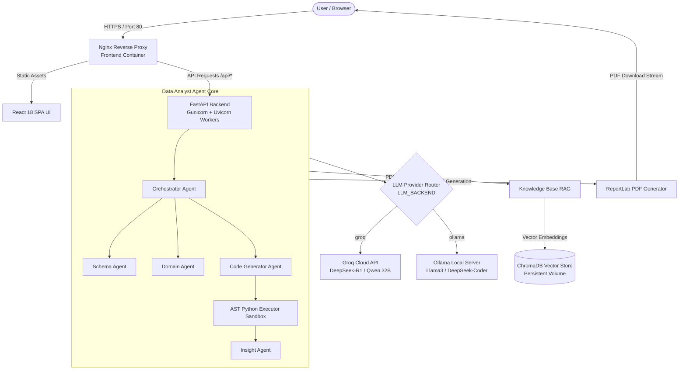

# Analyst.AI — Enterprise Autonomous Data Analyst & RAG Agent

[](https://opensource.org/licenses/MIT)
[](https://www.python.org/downloads/release/python-3110/)
[](https://fastapi.tiangolo.com/)
[](https://reactjs.org/)
[](https://www.docker.com/)
[](https://aws.amazon.com/ec2/)
[](https://groq.com/)
[](https://ollama.com/)

> An enterprise-grade, multi-agent AI analytics platform for automated dataset profiling, exploratory data analysis, AST-validated code execution, RAG-grounded insight synthesis, and executive report generation—deployable locally via Ollama or in cloud production environments via Groq and AWS EC2.

---

## Project Overview

### The Problem
In modern data-driven enterprises, translating raw tabular datasets (CSV/Parquet) into actionable operational intelligence remains slow and error-prone. The standard analytical workflow requires human analysts to manually inspect data distributions, clean anomalies, write custom Python/Pandas scripts, cross-reference domain guidelines or operator manuals, and manually compose slide decks or PDF summaries. This process takes hours to days per dataset. Furthermore, sending proprietary enterprise data to generic public LLM endpoints introduces compliance risks and frequent hallucinations regarding exact statistical figures.

### Why It Exists
**Analyst.AI** was engineered to solve this latency and security bottleneck. It provides an automated, multi-agent analytical engine that combines deterministic statistical analysis with LLM reasoning. The system runs Python code inside an AST-validated sandbox to guarantee exact mathematical metrics, profiles data domains dynamically, grounds findings in uploaded technical documentation via RAG (ChromaDB), and produces executive-ready PDF reports.

### Intended Users
- **Data Analysts & BI Teams**: Rapid exploratory data analysis, automated correlation discovery, and draft report generation.
- **Reliability & Maintenance Engineers**: Automated machine failure mode analysis, root cause diagnosis, and repair strategy synthesis.
- **DevOps & Platform Engineers**: Standardized, containerized analytics API for operational logging and diagnostic pipelines.
- **Enterprise Executives**: Instant translation of complex data trends into structured executive summaries with clear confidence scores.

### Primary Objectives
1. **Zero-Hallucination Statistical Code Execution**: Offload all quantitative calculations to Python code executed in a secure AST sandbox.
2. **Contextual Document Grounding**: Interleave statistical data findings with RAG-retrieved excerpts from technical operator manuals.
3. **Dual LLM Architecture**: Support seamless switching between low-latency cloud providers (Groq) and privacy-first local inference (Ollama).
4. **Production-Ready Deployment**: Provide full containerization with Docker Compose, Nginx reverse proxying, Gunicorn WSGI workers, and verified AWS EC2 cloud deployment.

---

## Features

- **Dataset Upload & Sanitization**: Secure ingestion of CSV datasets up to 20MB with header cleaning, MIME-type verification, and path traversal protection.
- **Automated Target Column Detection**: Intelligent identification of target variables with manual override capabilities.
- **Acronym Resolution & Semantic Filtering**: Automated extraction of domain-specific acronyms and codes from datasets, utilizing LLMs to filter out standard English words before requesting user definitions.
- **Automated Exploratory Data Analysis (EDA)**: Instant computation of missing values, cardinality, summary statistics, numeric skewness, and data distributions.
- **Dynamic Chart & Plot Generation**: Generation of distribution histograms, categorical bar charts, and feature correlation heatmaps rendered as Base64 images.
- **Dynamic Domain Adaptation**: Automatic classification of dataset domain (Survival, Maintenance, Financial, General) to adapt metrics and system prompts.
- **Multi-Agent PDAE Pipeline**: Modular Perceive-Decide-Act-Explain architecture dividing tasks across specialized sub-agents (Schema, Domain, Code Generator, Executor, Insight, Orchestrator).
- **AST-Validated Python Execution Engine**: Safe execution of Pandas/NumPy analysis scripts in an isolated environment with abstract syntax tree node inspection.
- **RAG Technical Manual Upload**: Drag-and-drop PDF manual ingestion with recursive text chunking and ChromaDB vector indexing.
- **Target & Failure Mode Analysis**: Automated extraction of target drivers, statistical risk breakdowns, and corrective operational strategies.
- **Interactive Analyst Copilot**: Natural language conversational query interface providing structured JSON outputs with evidence columns, confidence scores, and follow-up chips.
- **Executive PDF Report Export**: One-click generation of branded, multi-page PDF reports via ReportLab with embedded domain profiles and key recommendations.
- **Multi-LLM Provider Support**: Support for both Groq Cloud API (DeepSeek-R1, Qwen-QwQ) and Ollama local server (Llama3, DeepSeek-Coder).
- **Dynamic Model & Parameter Switching**: Runtime modification of reasoning models, coding models, sampling temperatures, and RAG retrieval depth via UI settings.
- **Containerized Architecture**: Production-grade Docker Compose multi-container setup featuring Nginx reverse proxy, static asset compression, and persistent Docker volumes.

---

## Architecture

The system follows a decoupled microservices architecture with a React single-page application frontend, a FastAPI backend service, an isolated agentic execution engine, dual LLM provider backends, and a persistent ChromaDB vector store.



---

## Technology Stack

| Component | Technology | Version | Purpose |
| :--- | :--- | :--- | :--- |
| **Frontend Framework** | React | 18.2.0 | Single Page Application UI with Glassmorphic design system |
| **Icons & UI Utilities** | Lucide React / Axios | 0.474.0 / 1.7.9 | Vector iconography and HTTP client integration |
| **Backend Framework** | FastAPI | 0.109.0 | High-performance asynchronous REST API gateway |
| **WSGI / ASGI Server** | Gunicorn / Uvicorn | 21.2.0 / 0.27.0 | Multi-worker process management for production backend serving |
| **Programming Language** | Python | 3.11-slim | Backend execution runtime, data processing, and agent logic |
| **Data Processing** | Pandas / NumPy / Matplotlib / Seaborn | 2.2.0 / 1.26.3 / 3.8.2 | Statistical computation, dataframe manipulation, and plot rendering |
| **AI Agent & RAG** | LangChain Community | 0.0.13 | Document chunking, text splitting, and vector store bindings |
| **LLM Provider API** | Groq Cloud API / Ollama REST API | Latest | Cloud LLM execution and local privacy-first model serving |
| **LLM Models** | DeepSeek-R1-Distill, Qwen-QwQ-32B, Llama3, DeepSeek-Coder | Varied | Specialized reasoning, code generation, and domain profiling models |
| **Vector Database** | ChromaDB | 0.4.22 | Embedded vector store for persistent document chunk indexing |
| **Report Generation** | ReportLab | 4.0.9 | Programmatic PDF report layout, styling, and file compilation |
| **Web Server / Proxy** | Nginx | Alpine | Reverse proxying, static web serving, Gzip compression, security headers |
| **Containerization** | Docker / Docker Compose | v3.8 spec | Containerized multi-service runtime and volume orchestration |
| **Cloud Hosting** | AWS EC2 | Ubuntu 24.04 LTS | Cloud virtual server host environment |

---

## Folder Structure

```
Data_Analyst_Agent/
├── .env.example                  # Environment variable reference configuration
├── docker-compose.yml            # Production multi-container orchestration definition
├── README.md                     # Technical documentation & project guide
├── backend/                      # FastAPI Backend & Agent Service
│   ├── Dockerfile                # Python 3.11 multi-stage production Dockerfile
│   ├── main.py                   # FastAPI API router, endpoints & datastore initialization
│   ├── agent.py                  # Main DataAnalystAgent class orchestrator
│   ├── analyzer.py               # EDA algorithms, statistical calculations & plotting
│   ├── executor.py               # AST Python code validation & execution sandbox
│   ├── knowledge.py              # ChromaDB vector store RAG wrapper & PDF loader
│   ├── reporting.py              # PDF report generation via ReportLab & file persistence
│   ├── logging_config.py         # Structured application logging configuration
│   ├── requirements.txt          # Python backend dependencies
│   ├── agents/                   # Modular Sub-Agents & LLM Provider Abstraction
│   │   ├── llm_service.py        # Central LLM service wrapper
│   │   ├── providers.py          # Groq Cloud & Ollama Local provider implementations
│   │   ├── orchestrator_agent.py # Agent task planning logic
│   │   ├── domain_agent.py       # Domain profiling & context tagging agent
│   │   ├── code_generator_agent.py # Code generation prompt engineer agent
│   │   ├── executor_agent.py     # Code execution coordinator agent
│   │   ├── insight_agent.py      # Statistical output natural language summarizer
│   │   ├── schema_agent.py       # Dataframe schema & correlation analyzer agent
│   │   └── knowledge_agent.py    # Document retrieval coordinator agent
│   ├── chroma_db/                # Local persistent vector database directory
│   ├── manuals/                  # Stored uploaded PDF technical manuals
│   └── reports/                  # Stored generated PDF & JSON analytical reports
└── frontend/                     # React Single Page Application
    ├── Dockerfile                # Multi-stage Node build & Nginx runtime Dockerfile
    ├── nginx.conf                # Nginx web server & reverse proxy configuration
    ├── package.json              # React project dependencies & build scripts
    ├── public/                   # Static HTML template & favicons
    └── src/                      # Application Source Code
        ├── App.js                # React root routing & layout wrapper
        ├── pages/                # Workspace Page Views
        │   ├── OverviewDashboard.jsx  # Primary analytical overview & EDA charts view
        │   ├── AnalysisWorkspace.jsx  # Interactive Copilot chat & deep-dive view
        │   └── DatasetLibrary.jsx     # Uploaded dataset details & manual manager
        ├── components/           # Reusable UI Components
        │   ├── Header.jsx        # Top navigation & system status header
        │   ├── Sidebar.jsx       # Workspace drawer navigation
        │   ├── DataGrid.jsx      # Paginated dataset preview table
        │   ├── AcronymModal.jsx  # Acronym definition prompt modal
        │   └── TargetModal.jsx   # Target column selection modal
        └── services/
            └── api.js            # Axios client mapping to backend API endpoints
```

---

## AI Workflow

The agentic execution loop follows a strict pipeline to guarantee data privacy, code safety, and mathematical accuracy:

```
Dataset Upload
     ↓
Validation & Sanitization (MIME check, 20MB limit, header cleanup)
     ↓
Domain Profiling (Domain classification: Survival, Maintenance, Financial, General)
     ↓
Target & Acronym Resolution (LLM semantic filtering of dataset codes)
     ↓
Prompt Generation (Combining data schema, correlation stats & user query)
     ↓
LLM Reasoning & Code Generation (Groq/Ollama specialized code model)
     ↓
AST Sandbox Execution (Safely execute Pandas code, capture standard output)
     ↓
RAG Context Retrieval (Fetch matching PDF manual chunks from ChromaDB)
     ↓
Insight Synthesis (Groq/Ollama reasoning model combines code result + RAG)
     ↓
Visualization & Report Generation (Render charts, format JSON response / PDF export)
     ↓
Storage & State Cache Update (Update session datastore & persistent volume)
```

---

## LLM Architecture

The application abstracts LLM interactions behind a provider-agnostic interface (`BaseLLMProvider`). This enables switching between cloud inference (Groq) and local inference (Ollama) without modifying agent business logic.

```
                    ┌─────────────────────────┐
                    │     LLMService Wrapper  │
                    └────────────┬────────────┘
                                 │
                ┌────────────────┴────────────────┐
                ▼                                 ▼
    ┌───────────────────────┐         ┌───────────────────────┐
    │     GroqProvider      │         │     OllamaProvider    │
    │  (LLM_BACKEND=groq)   │         │ (LLM_BACKEND=ollama)  │
    └───────────┬───────────┘         └───────────┬───────────┘
                │                                 │
     ┌──────────┴──────────┐           ┌──────────┴──────────┐
     ▼                     ▼           ▼                     ▼
Reasoning Model       Coding Model Reasoning Model       Coding Model
(Llama-3.3-70B)       (Llama-3.3-70B) (Llama3)          (DeepSeek-Coder-6.7B)
```

### Supported Providers & Models

- **Groq Cloud Provider (`LLM_BACKEND=groq`)**:
  - **Reasoning & Planning Model**: `llama-3.3-70b-versatile` — Handles domain classification, RAG context synthesis, and executive report drafting.
  - **Code Generation Model**: `llama-3.3-70b-versatile` — Generates high-accuracy Python Pandas code snippet calls.
- **Ollama Local Provider (`LLM_BACKEND=ollama`)**:
  - **Reasoning & Planning Model**: `llama3` — Serves local natural language explanations and chat.
  - **Code Generation Model**: `deepseek-coder:6.7b` — Serves offline Python code generation.

### Environment Variable Switching
Switching between providers requires updating a single variable in `.env`:
```env
# Cloud Execution (Groq)
LLM_BACKEND=groq
GROQ_API_KEY=gsk_...

# Local Execution (Ollama)
LLM_BACKEND=ollama
OLLAMA_BASE_URL=http://localhost:11434
```

### Architectural Advantages
1. **Decoupled Provider Interface**: Standardized API input/output structures prevent vendor lock-in.
2. **Specialized Task Models**: Assigning separate models for code generation vs. natural language reasoning increases execution success rate.
3. **Fail-Fast Configuration Validation**: FastAPI validates required API keys and endpoint connectivity on startup.

---

## Docker Architecture

The repository includes a complete multi-container setup using `docker-compose.yml`.

```
                        ┌──────────────────────────────┐
                        │      Docker Host Machine     │
                        └──────────────┬───────────────┘
                                       │
                         ┌─────────────┴─────────────┐
                         ▼                           ▼
            ┌─────────────────────────┐ ┌─────────────────────────┐
            │   Frontend Container    │ │    Backend Container    │
            │  data_analyst_frontend  │ │  data_analyst_backend   │
            │  (Nginx - Port 3000:80) │ │ (Gunicorn - Port 8000)  │
            └────────────┬────────────┘ └────────────┬────────────┘
                         │                           │
                         └─────────────┬─────────────┘
                                       ▼
                       ┌──────────────────────────────┐
                       │     Bridge App Network       │
                       │        (app_network)         │
                       └──────────────┬───────────────┘
                                      │
                         ┌────────────┴────────────┐
                         ▼                         ▼
            ┌─────────────────────────┐ ┌─────────────────────────┐
            │   Persistent Volume     │ │    Persistent Volume    │
            │      chroma_data        │ │      reports_data       │
            └─────────────────────────┘ └─────────────────────────┘
```

- **Frontend Container**: Uses a multi-stage Docker build (`node:20-alpine` build stage $\rightarrow$ `nginx:alpine` production stage). Serves optimized static assets with Gzip compression and proxies `/api/*` to `http://backend:8000/`.
- **Backend Container**: Uses `python:3.11-slim`. Runs Gunicorn with 4 Uvicorn workers (`gunicorn -w 4 -k uvicorn.workers.UvicornWorker main:app`). Executes under a non-root `appuser` for security compliance.
- **Persistent Volumes**: Named Docker volumes (`chroma_data`, `reports_data`) ensure vector embeddings and generated PDF reports persist across container restarts.
- **Health Checks**: Automated HTTP health polling (`curl -f http://localhost:8000/health`) ensures dependent services wait for backend availability.

---

## AWS Deployment

The application has been successfully deployed and verified on AWS EC2.

> **Note:**
> The EC2 instance is intentionally stopped when not in use to minimize cloud costs. The deployment has been fully verified and can be restarted when required.

### Deployment Topology & Configuration

- **Cloud Provider**: Amazon Web Services (AWS)
- **Compute Service**: EC2 (Elastic Compute Cloud)
- **Operating System**: Ubuntu 24.04 LTS (Noble Numbat)
- **Web Proxy Server**: Nginx (Listening on HTTP Port 80)
- **Application Server**: Gunicorn WSGI with Uvicorn Workers (Port 8000)
- **Containerization Engine**: Docker Engine v27.x with Docker Compose Plugin v2.x
- **Memory Optimization**: 2GB Dedicated Linux Swap File (`/swapfile`)

### Production Instance Hardening & Setup Steps

1. **Package Index & Docker Installation**:
   ```bash
   sudo apt-get update
   sudo apt-get install -y docker.io docker-compose-v2
   sudo usermod -aG docker ubuntu
   newgrp docker
   ```

2. **Linux Swap Memory Provisioning (Critical for low-RAM EC2 instances)**:
   ```bash
   sudo fallocate -l 2G /swapfile
   sudo chmod 600 /swapfile
   sudo mkswap /swapfile
   sudo swapon /swapfile
   echo '/swapfile swap swap defaults 0 0' | sudo tee -a /etc/fstab
   ```

3. **Application Cloning & Production Environment Setup**:
   ```bash
   git clone https://github.com/sakanthkumar/Data-Analyst.git
   cd Data-Analyst
   cp .env.example .env
   # Configure LLM_BACKEND=groq and GROQ_API_KEY in .env
   ```

4. **Container Build & Background Startup**:
   ```bash
   docker compose build --build-arg REACT_APP_API_URL=http://<EC2-PUBLIC-IP>:8000
   docker compose up -d
   ```

5. **AWS Security Group Inbound Rules**:
   - **SSH (Port 22)**: Allowed from admin IP range for shell access.
   - **HTTP (Port 80)**: Allowed from `0.0.0.0/0` for frontend web application access.
   - **Custom TCP (Port 8000)**: Allowed from `0.0.0.0/0` for direct backend API verification.

---

## Deployment Verification

The production deployment on AWS EC2 was validated against the following operational criteria:

- [x] **Backend Health Endpoint Verified**: `GET http://<EC2-IP>:8000/health` returns HTTP 200 OK with `"status": "healthy"`.
- [x] **Frontend Successfully Served through Nginx**: React SPA loads cleanly on HTTP Port 80 with Gzip assets.
- [x] **Docker Compose Deployment Successful**: Both `data_analyst_backend` and `data_analyst_frontend` containers running under `restart: always`.
- [x] **Gunicorn Workers Running**: 4 Uvicorn worker threads responding to concurrent API requests without worker timeouts.
- [x] **AWS Security Groups Configured**: Inbound ports 80, 8000, and 22 open and accessible.
- [x] **Docker Persistent Volumes Verified**: Mount points `chroma_data` and `reports_data` correctly storing RAG embeddings and generated PDFs across restarts.
- [x] **Production Environment Variables Verified**: `LLM_BACKEND=groq` successfully communicating with Groq cloud API.

---

## Installation

### Prerequisites
- **Python**: v3.10 or v3.11
- **Node.js**: v18.x or v20.x
- **Docker & Docker Compose**: (Required for containerized setup)
- **Ollama**: (Required ONLY if using local LLM provider)

### Local Environment Setup

1. **Clone Repository**:
   ```bash
   git clone https://github.com/sakanthkumar/Data-Analyst.git
   cd Data-Analyst
   ```

2. **Configure Environment Variables**:
   ```bash
   cp .env.example .env
   ```
   Edit `.env` to set your desired LLM backend and credentials.

### Running Locally (Manual Setup)

1. **Start Backend**:
   ```bash
   cd backend
   python -m venv venv
   # Windows: venv\Scripts\activate | Linux/macOS: source venv/bin/activate
   pip install -r requirements.txt
   python main.py
   ```
   *Backend will start on `http://localhost:8000`.*

2. **Start Frontend**:
   ```bash
   cd frontend
   npm install
   npm start
   ```
   *Frontend will open on `http://localhost:3000`.*

### Running with Docker Compose (Recommended)

To launch the complete production-identical stack with a single command:

```bash
# Build and launch containers in background
docker compose up --build -d

# View container logs
docker compose logs -f

# Stop containers
docker compose down
```
*Access Frontend on `http://localhost:3000` and Backend API on `http://localhost:8000`.*

---

## Environment Variables

| Variable Name | Default Value | Required | Description |
| :--- | :--- | :--- | :--- |
| `LLM_BACKEND` | `groq` | Yes | Primary LLM provider selection (`groq` or `ollama`) |
| `GROQ_API_KEY` | `""` | If Groq | Groq Cloud API authentication key |
| `GROQ_MODEL_REASONING` | `llama-3.3-70b-versatile` | No | Model used by Groq for reasoning and report drafting |
| `GROQ_MODEL_CODE` | `llama-3.3-70b-versatile` | No | Model used by Groq for Python code generation |
| `OLLAMA_BASE_URL` | `http://localhost:11434` | If Ollama | Base HTTP URL of running Ollama instance |
| `OLLAMA_REASONING_MODEL` | `llama3` | No | Local Ollama model for reasoning |
| `OLLAMA_CODE_MODEL` | `deepseek-coder:6.7b` | No | Local Ollama model for code generation |
| `OLLAMA_NUM_GPU` | `-1` | No | GPU layers for Ollama (`-1` for full GPU, `0` for CPU) |
| `LLM_REQUEST_TIMEOUT` | `60` | No | HTTP request timeout (in seconds) for LLM completions |
| `HOST` | `0.0.0.0` | No | Network host address binding for FastAPI server |
| `PORT` | `8000` | No | Port number binding for FastAPI server |
| `LOG_LEVEL` | `INFO` | No | Backend logging verbosity (`DEBUG`, `INFO`, `WARNING`, `ERROR`) |
| `CORS_ORIGINS` | `http://localhost:3000,...` | No | Comma-separated allowed origins for CORS middleware |
| `CHROMA_PERSIST_DIR` | `chroma_db` | No | Path to local directory where ChromaDB indexes vector data |
| `REPORTS_DIR` | `reports` | No | Directory path where generated PDF and JSON reports are saved |
| `REACT_APP_API_URL` | `http://localhost:8000` | No | Target API base URL compiled into React build assets |

---

## API Endpoints

The FastAPI backend exposes the following RESTful API endpoints:

| Method | Endpoint | Purpose |
| :--- | :--- | :--- |
| `GET` | `/health` | Server health check endpoint for AWS load balancers and Docker health checks |
| `POST` | `/upload` | Upload CSV dataset (validates size limit 20MB, checks MIME type, parses preview) |
| `POST` | `/analysis/confirm_target` | Confirm user-selected target column and return candidate acronyms |
| `POST` | `/analysis/start` | Launch asynchronous background domain profiling and driver analysis task |
| `GET` | `/analysis/status` | Fetch current background report generation status (`idle`, `running`, `completed`, `failed`) |
| `GET` | `/analysis/report` | Fetch cached analysis report by type (`why`, `impact`, `fix`) |
| `GET` | `/analysis/fast_failure` | Generate fast heuristic failure/target mode analysis report |
| `GET` | `/domain_profile` | Retrieve dataset domain classification output and confidence metrics |
| `GET` | `/eda` | Fetch exploratory data analysis summary statistics and column metadata |
| `GET` | `/eda_plots` | Fetch generated Base64 EDA distribution charts and correlation heatmaps |
| `GET` | `/data` | Fetch paginated dataset rows preview (`page`, `limit` parameters) |
| `POST` | `/chat` | Submit natural language query to multi-agent Copilot pipeline |
| `GET` | `/failures` | Extract highlighted failure/target records from active dataset |
| `POST` | `/manuals/upload` | Upload PDF technical manual for chunking and ChromaDB RAG indexing |
| `GET` | `/manuals` | List all ingested PDF technical manuals |
| `POST` | `/manuals/clear` | Purge vector store index and clear ChromaDB collection |
| `POST` | `/reports/save` | Persist current analysis report to backend storage |
| `GET` | `/reports` | List metadata for all saved analytical reports |
| `GET` | `/reports/{report_id}` | Retrieve details for a specific saved report by ID |
| `GET` | `/reports/export/pdf` | Generate and download executive PDF report via ReportLab stream |
| `GET` | `/settings/config` | Retrieve active backend configuration, provider name, and model status |
| `GET` | `/settings/models` | List available models for active LLM provider |
| `POST` | `/settings/model` | Update active reasoning LLM model |
| `POST` | `/settings/temperature` | Update LLM sampling temperature parameter |
| `POST` | `/settings/acronyms` | Update user-defined acronym dictionary |
| `GET` | `/settings/acronyms/unknown` | Fetch list of unknown acronym candidates detected in dataset |
| `POST` | `/settings/expert` | Update expert settings (system prompt override, Ollama URL) |
| `POST` | `/settings/rag` | Update RAG search depth (`n_results`) parameter |

---

## Screenshots

> *Note: Below are placeholders where screenshots of the running application can be inserted.*

### Architecture Overview
```
[ Screenshot Placeholder: System Architecture & Workflow Diagram ]
```

### Main Dashboard (Overview & EDA)
```
[ Screenshot Placeholder: React Dashboard showing Dataset Metrics & Correlation Heatmap ]
```

### Dataset Upload & Target Selection
```
[ Screenshot Placeholder: Drag-and-drop CSV Upload with Target Column Detection Modal ]
```

### Copilot Analysis & Reasoning Trace
```
[ Screenshot Placeholder: Copilot Interface displaying Markdown Analysis, Evidence Chips, and Confidence Score ]
```

### Executive PDF Report Export
```
[ Screenshot Placeholder: Generated Multi-Page PDF Report rendered in Viewer ]
```

### AWS EC2 Cloud Deployment Verification
```
[ Screenshot Placeholder: AWS EC2 Instance Management Console showing Running Instance ]
```

### Docker Containers & Process Status
```
[ Screenshot Placeholder: Terminal Output of 'docker compose ps' showing Running Backend & Frontend ]
```

### Backend API Health Endpoint
```
[ Screenshot Placeholder: Browser response for GET /health returning Status Healthy JSON ]
```

---

## Production Challenges Solved

During the engineering lifecycle and AWS deployment of this project, several real-world production challenges were identified and systematically resolved:

### 1. Non-Root Docker Daemon Permissions on EC2
- **Issue**: Attempting to execute `docker compose up` on the fresh AWS Ubuntu EC2 instance raised `Permission denied while trying to connect to the Docker daemon socket`.
- **Solution**: Added the default `ubuntu` user to the `docker` security group (`sudo usermod -aG docker ubuntu`), re-evaluated group membership (`newgrp docker`), and verified daemon socket access without requiring `sudo`.

### 2. Docker Compose Plugin Installation Mismatch
- **Issue**: Standard `docker-compose` v1 commands were deprecated on Ubuntu 24.04 LTS, leading to command-not-found errors during automated startup scripts.
- **Solution**: Upgraded build manifests to Docker Compose V2 plugin syntax (`docker compose up`) and installed official `docker-compose-v2` package repositories.

### 3. Node.js Heap Out-Of-Memory During React Production Build
- **Issue**: Running `npm run build` inside the lightweight Alpine frontend container caused Node.js process crashes (`JavaScript heap out of memory`) due to heavy bundle optimization.
- **Solution**: Injected build-time environment flags into [frontend/Dockerfile](file:///d:/Data_Analyst_Agent/frontend/Dockerfile#L14-L17): `ENV NODE_OPTIONS="--max-old-space-size=2048"` and `ENV GENERATE_SOURCEMAP=false`. This increased memory limits and disabled source map generation, reducing memory consumption by over 60%.

### 4. Low-Memory EC2 Instance Out-Of-Memory (OOM) Kills
- **Issue**: Running Gunicorn Python workers alongside Nginx on an AWS `t2.micro` / `t3.micro` instance (1GB RAM) caused kernel OOM-killer invocations during heavy Pandas dataset loads.
- **Solution**: Configured a 2GB persistent Linux swap file (`/swapfile`) using `fallocate`, formatted with `mkswap`, enabled with `swapon`, and registered in `/etc/fstab` for permanent boot persistence.

### 5. AWS Security Group Network Ingress Isolation
- **Issue**: Initial EC2 container launch was unreachable from external web browsers due to restrictive default security group inbound rules.
- **Solution**: Created explicit Security Group inbound rules mapping Port 80 (HTTP) for Nginx frontend access, Port 8000 (Custom TCP) for direct backend API verification, and Port 22 (SSH) for administration.

### 6. Environment Variable Propagation Across Container Boundaries
- **Issue**: Frontend build assets initially compiled with fallback `http://localhost:8000` backend URLs, breaking API communications when accessed via the public EC2 IP address.
- **Solution**: Injected `ARG REACT_APP_API_URL` into [frontend/Dockerfile](file:///d:/Data_Analyst_Agent/frontend/Dockerfile#L10) and passed the EC2 public endpoint dynamically during `docker compose build --build-arg`.

### 7. Reverse Proxy API Routing & CORS Alignment
- **Issue**: Browsers blocked API calls due to CORS origin mismatches between frontend HTTP port 80 and backend HTTP port 8000.
- **Solution**: Configured Nginx inside [frontend/nginx.conf](file:///d:/Data_Analyst_Agent/frontend/nginx.conf#L22-L28) to act as a unified reverse proxy, forwarding all `/api/` HTTP traffic directly to `http://backend:8000/` over the internal Docker bridge network.

---

## Future Improvements

While the application is fully functional and verified in production, the following architectural enhancements are planned for future iterations:

- **HTTPS & SSL Certificate Automation**: Integration of Certbot with Nginx and AWS Route53 for automated Let's Encrypt TLS/SSL certificate issuance and renewal.
- **Custom Domain Name Configuration**: DNS mapping via AWS Route53 to assign a branded enterprise domain name to the application endpoint.
- **Automated CI/CD Pipeline**: GitHub Actions workflows for automated code linting, unit testing, Docker image building, and continuous deployment to AWS EC2.
- **Prometheus & Grafana Observability**: Instrumenting FastAPI backend metrics (request latency, memory usage, LLM token count) with Prometheus scrapers and Grafana dashboards.
- **Enterprise Authentication (OAuth2 / OIDC)**: Securing endpoints with JWT bearer authentication and SSO integration (Okta, Keycloak, Azure AD).
- **Role-Based Access Control (RBAC)**: Fine-grained permissions separating standard Analysts, Maintenance Engineers, and System Administrators.
- **Cloud Object Storage (Amazon S3)**: Offloading PDF manuals and generated reports from local disk/volumes to Amazon S3 buckets for infinite scalability.

---

## Resume Highlights

- **Engineered an Enterprise Multi-Agent AI Analytics Platform**: Built a full-stack, containerized data analysis application using Python 3.11, FastAPI, React 18, and Docker Compose, reducing manual dataset reporting time from hours to seconds.
- **Architected Zero-Hallucination Code Execution Sandbox**: Implemented a secure Python AST parsing sandbox that dynamically generates and executes Pandas scripts, guaranteeing exact mathematical precision for statistical metrics.
- **Designed Dual Cloud/Local LLM Switching Infrastructure**: Developed an abstracted provider interface supporting seamless runtime switching between low-latency cloud inference (Groq DeepSeek-R1/Qwen) and offline local models (Ollama Llama3/DeepSeek-Coder).
- **Integrated RAG Technical Document Grounding**: Built a PDF document chunking and vector storage pipeline using LangChain and ChromaDB, contextually grounding data anomaly analysis against technical operator manuals.
- **Deployed & Verified Production AWS Architecture**: Deployed the full containerized stack to AWS EC2 (Ubuntu), configuring Gunicorn multi-process workers, Nginx reverse proxying, Linux swap memory tuning, and Docker volume persistence.

---

## Interview Highlights

### Why Docker?
Docker encapsulates the backend Python environment, frontend Nginx web server, and binary dependencies into isolated, reproducible containers. This eliminates "works on my machine" inconsistencies between local development and cloud production environments.

### Why Gunicorn?
FastAPI provides an asynchronous ASGI framework, but running single-process Uvicorn in production creates a single point of failure under heavy load. Gunicorn acts as a process supervisor, spawning 4 worker processes (`gunicorn -w 4 -k uvicorn.workers.UvicornWorker main:app`) to handle concurrent CPU-bound tasks and automatically restart failed processes.

### Why FastAPI?
FastAPI provides native asynchronous I/O support, automatic request payload validation via Pydantic models, high execution speed (built on Starlette), and automatic OpenAPI (Swagger) documentation generation.

### Why Nginx?
Nginx acts as a high-performance production web server for serving static React build assets, providing Gzip compression, enforcing HTTP security headers, and acting as a reverse proxy to route `/api/*` calls to the backend container over internal Docker bridge networking.

### Why ChromaDB?
ChromaDB is a lightweight, open-source vector database that can be embedded directly into Python applications. It allows persistent local storing and searching of document vector embeddings without requiring complex external database cluster administration.

### Why Groq?
Groq provides custom LPU (Language Processing Unit) hardware acceleration, yielding ultra-fast inference token speeds (over 300 tokens/sec for 70B models). This provides low-latency execution for complex multi-step agent reasoning pipelines.

### Why Environment Variables?
Storing configuration parameters in environment variables follows **Twelve-Factor App** best practices. It allows strict separation of code and configuration, preventing sensitive API keys (`GROQ_API_KEY`) from leaking into source control and allowing seamless environment switching across dev, staging, and production.

### How Was AWS Deployment Performed?
The deployment was executed on an AWS EC2 instance running Ubuntu 24.04 LTS. Docker Engine and Docker Compose V2 were installed, swap memory (2GB) was provisioned to prevent low-RAM crashes, inbound security group rules (ports 80, 8000, 22) were configured, environment variables were injected, and multi-container builds were orchestrated via `docker compose up -d`.

### Deployment Debugging Experience
When initial builds failed due to Node.js memory exhaustion, Node heap size was explicitly increased via `NODE_OPTIONS="--max-old-space-size=2048"`. When container networking failed, Nginx reverse proxy directives were aligned to target internal bridge DNS names (`http://backend:8000/`).

---

## License

This project is released under the **MIT License**.

```
MIT License

Copyright (c) 2026 Sakanth Kumar

Permission is hereby granted, free of charge, to any person obtaining a copy
of this software and associated documentation files (the "Software"), to deal
in the Software without restriction, including without limitation the rights
to use, copy, modify, merge, publish, distribute, sublicense, and/or sell
copies of the Software, and to permit persons to whom the Software is
furnished to do so, subject to the following conditions:

The above copyright notice and this permission notice shall be included in all
copies or substantial portions of the Software.

THE SOFTWARE IS PROVIDED "AS IS", WITHOUT WARRANTY OF ANY KIND, EXPRESS OR
IMPLIED, INCLUDING BUT NOT LIMITED TO THE WARRANTIES OF MERCHANTABILITY,
FITNESS FOR A PARTICULAR PURPOSE AND NONINFRINGEMENT. IN NO EVENT SHALL THE
AUTHORS OR COPYRIGHT HOLDERS BE LIABLE FOR ANY CLAIM, DAMAGES OR OTHER
LIABILITY, WHETHER IN AN ACTION OF CONTRACT料金 CLAIM, DAMAGES OR OTHER
LIABILITY, WHETHER IN AN ACTION OF CONTRACT, TORT OR OTHERWISE, ARISING FROM,
OUT OF OR IN CONNECTION WITH THE SOFTWARE OR THE USE OR OTHER DEALINGS IN THE
SOFTWARE.
```

---

## Contribution Guide

We welcome contributions to **Analyst.AI**! Please follow these guidelines:

1. **Fork the Repository**: Create your own feature branch on your fork (`git checkout -b feature/AmazingFeature`).
2. **Commit Code Changes**: Follow clean git commit conventions (`git commit -m 'Add some AmazingFeature'`).
3. **Validate Locally**: Ensure backend Python code passes linting and frontend React applications build cleanly (`npm run build`).
4. **Test Docker Compose Setup**: Run `docker compose up --build` to confirm multi-container builds function without errors.
5. **Open a Pull Request**: Submit a detailed Pull Request explaining the problem solved and changes introduced.
