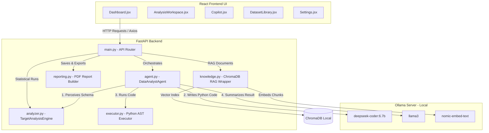
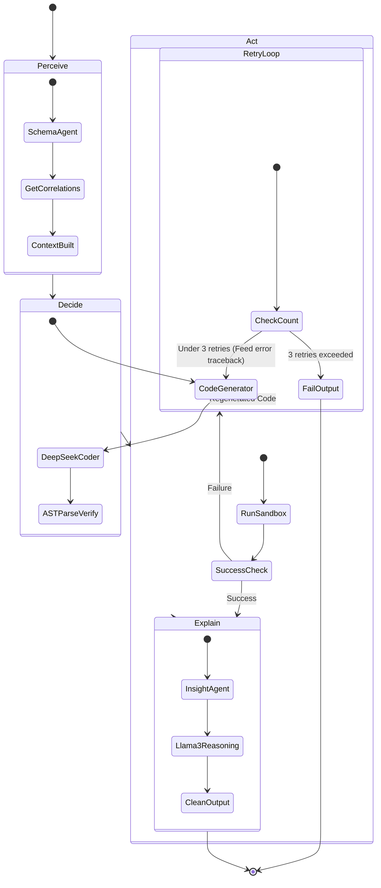
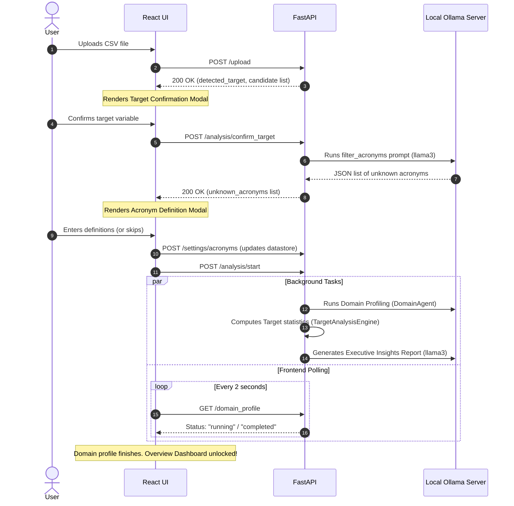

# Analyst.AI - System Architecture & Multi-Agent Design

This document details the system architecture, component breakdown, and runtime workflows for **Analyst.AI** (the Data Analyst Agent). It is designed to serve as a comprehensive blueprint for engineering reviews, audits, and architectural onboarding.

---

## 1. System Overview

Analyst.AI is a secure, local-first data analytics platform. It automates raw dataset ingestion (CSV), semantic domain profiling, driver and correlation analysis, RAG-augmented technical explanation (PDF manuals), and executive report compiling.

### Tech Stack
*   **Frontend**: React (Glassmorphic SPA, Chart.js, Tailwind CSS/CSS modules).
*   **Backend**: FastAPI, Pandas, NumPy, ReportLab (PDF compiling).
*   **AI Engine**: Local Ollama Server (`deepseek-coder:6.7b` for code generation, `llama3` for reasoning & insights).
*   **Vector Store**: ChromaDB with `nomic-embed-text` embeddings.

---

## 2. Complete System Diagram

The system operates across three tiers: the Client SPA, the FastAPI Backend, and the Local Ollama server.

---

## 3. Core Component Breakdown

### A. Web Gateway & Lifecycle Controller ([main.py](file:///d:/Data_Analyst_Agent/backend/main.py))
Handles REST API routing, request validation, CORS, and coordinates state.
*   **Data Lifecycle State**: Stores in-memory session variables (`DATASTORE`) such as `df`, `dataset_session_id`, `domain_profile`, `acronyms`, and `chat_history`.
*   **Analysis Cache (`ANALYSIS_CACHE`)**: Stores pre-computed analyses to allow immediate loading of dashboard metrics.
*   **Background Threads**: Spawns background worker daemons to run heavy analytical and profiling tasks without locking the event loop.

### B. Core Agent Orchestration ([agent.py](file:///d:/Data_Analyst_Agent/backend/agent.py))
Declares [DataAnalystAgent](file:///d:/Data_Analyst_Agent/backend/agent.py#L21-L395), which implements the primary cognitive pipeline. It maintains a sliding-window conversational memory (up to 5 turns) and delegates sub-tasks to specialized sub-agents.

### C. Statistical & Mathematical Engines ([analyzer.py](file:///d:/Data_Analyst_Agent/backend/analyzer.py))
Executes deterministic numerical operations.
*   **`auto_eda`**: Computes missing values, datatypes, IQR outliers, and summary statistics.
*   **`TargetAnalysisEngine`**: Detects targets, calculates class distributions, or isolates regression outliers.
*   **`get_correlation_stats`**: Evaluates Pearson correlations and tracks average feature shifts between normal and anomaly states.

### D. Safe Python Sandbox ([executor.py](file:///d:/Data_Analyst_Agent/backend/executor.py))
Strict sandbox for LLM-generated code execution.
*   **Sanitization**: Cleans smart quotes and strips markdown code fences.
*   **Static Analysis**: Uses the Python Abstract Syntax Tree (`ast.parse`) to detect syntax errors before execution.
*   **Blacklist Verification**: Blocks unsafe imports (`os`, `sys`, `subprocess`, `open`, etc.).
*   **Execution Sandbox**: Runs verified code in an isolated scope via `exec()` and captures standard errors.

### E. PDF Vector Store ([knowledge.py](file:///d:/Data_Analyst_Agent/backend/knowledge.py))
Implements Retrieval-Augmented Generation (RAG).
*   Loads technical manuals using `PyPDFLoader`.
*   Splits documents via `RecursiveCharacterTextSplitter` (chunk size: 1000, overlap: 200).
*   Indexes dense vectors in local ChromaDB using `OllamaEmbeddings` running `nomic-embed-text`.
*   Features a mock-in-memory fallback embedding engine to guarantee application startup if the model isn't yet pulled.

### F. Output Normalizer ([normalizer.py](file:///d:/Data_Analyst_Agent/backend/normalizer.py))
Deterministic text processing library enforcing semantic separation.
*   Removes headings, formatting text, or length overruns.
*   Enforces strict separation by checking a forbidden keywords index to prevent analytical leakage (e.g., ensuring "action items" don't leak into the Root Cause section).

---

## 4. Master Agent Cognitive Architecture (The PDAE Loop)

The Agent resolves conversational data questions through a structured **Perceive-Decide-Act-Explain (PDAE)** loop:

### Specialized Agents & Roles

| Agent | Module | Role | LLM Service Needed |
| :--- | :--- | :--- | :--- |
| **OrchestratorAgent** | [orchestrator_agent.py](file:///d:/Data_Analyst_Agent/backend/agents/orchestrator_agent.py) | Analyzes queries to plan routing pathways. | ✅ Yes (`llama3`) |
| **DomainAgent** | [domain_agent.py](file:///d:/Data_Analyst_Agent/backend/agents/domain_agent.py) | Profiles raw schemas to extract semantic domains and KPIs. | ✅ Yes (`llama3`) |
| **SchemaAgent** | [schema_agent.py](file:///d:/Data_Analyst_Agent/backend/agents/schema_agent.py) | Inspects dataframe structures to build localized context blocks. | ❌ No |
| **CodeGeneratorAgent** | [code_generator_agent.py](file:///d:/Data_Analyst_Agent/backend/agents/code_generator_agent.py) | Translates questions and contexts into pandas code. | ✅ Yes (`deepseek-coder:6.7b`) |
| **ExecutorAgent** | [executor_agent.py](file:///d:/Data_Analyst_Agent/backend/executor.py) | Sandboxes code execution and handles exceptions. | ❌ No |
| **InsightAgent** | [insight_agent.py](file:///d:/Data_Analyst_Agent/backend/agents/insight_agent.py) | Formulates grounded responses based on code outputs. | ✅ Yes (`llama3`) |
| **AnalyticsAgent** | [analytics_agent.py](file:///d:/Data_Analyst_Agent/backend/agents/analytics_agent.py) | Coordinates EDA calculations and plot rendering. | ❌ No |
| **KnowledgeAgent** | [knowledge_agent.py](file:///d:/Data_Analyst_Agent/backend/agents/knowledge_agent.py) | Queries PDF manual manuals from ChromaDB. | ❌ No |
| **NormalizationAgent** | [normalization_agent.py](file:///d:/Data_Analyst_Agent/backend/agents/normalization_agent.py) | Enforces deterministic boundaries on outputs. | ❌ No |

---

## 5. End-to-End Application Sequences

### A. Ingestion and Setup Lifecycle
The sequence below outlines how the system prepares a dataset for analysis:

### B. Copilot Conversational Loop
The sequence below describes the flow of a natural language query in the chat UI:

```mermaid
sequenceDiagram
    autonumber
    actor User
    participant Frontend as React UI
    participant Backend as FastAPI
    participant Orchestrator as OrchestratorAgent
    participant SchemaAgent as SchemaAgent
    participant CodeGen as CodeGeneratorAgent
    participant Sandbox as AST Executor
    participant InsightAgent as InsightAgent
    participant Ollama as Local Ollama Server

    User->>Frontend: Submits question (e.g. "What is the average speed of failing tools?")
    Frontend->>Backend: POST /chat
    Backend->>Orchestrator: orchestrator.execute(question)
    Orchestrator->>Ollama: Check route (llama3)
    Ollama-->>Orchestrator: JSON {"route": ["SchemaAgent", "CodeGeneratorAgent", "ExecutorAgent", "InsightAgent"]}
    
    rect rgb(30, 40, 50)
        Note over Backend, Ollama: Start Execution Plan
        Backend->>SchemaAgent: perceive(question)
        SchemaAgent-->>Backend: Data schema + correlation context
        
        Backend->>CodeGen: decide(context, question)
        CodeGen->>Ollama: call_llm (deepseek-coder:6.7b)
        Ollama-->>CodeGen: python code string
        
        Backend->>Sandbox: act(code)
        Note over Sandbox: Run AST parsing check & safety check
        Sandbox->>Sandbox: exec(code) on df
        Sandbox-->>Backend: success=True, result="104.2"
        
        Backend->>InsightAgent: explain(question, result)
        InsightAgent->>Ollama: call_llm (llama3)
        Ollama-->>InsightAgent: Markdown answer
    end

    Backend->>Ollama: Structure response to JSON
    Ollama-->>Backend: JSON object (answer, evidence, recommendations, trace)
    Backend-->>Frontend: HTTP 200 OK (Structured JSON)
    Frontend-->>User: Renders text response + chart suggestion
```

