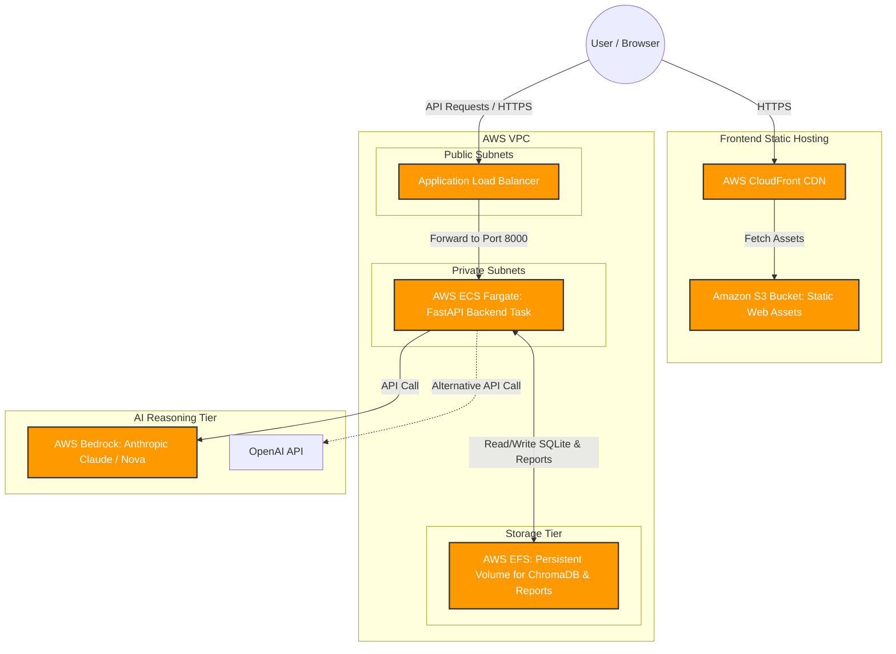

# AWS Deployment Readiness Assessment

This document assesses the readiness of the Data Analyst Agent project for deployment in the AWS cloud. It identifies critical architectural blockers, provides a target AWS deployment architecture, and contains draft configuration files (`Dockerfiles` and `docker-compose.yml`) to support containerization and deployment.

---

## 1. Readiness Summary
The project is **not immediately ready** for a production-ready AWS deployment. While the application functions correctly in a local environment, several critical architectural and configuration changes are required to transition it to a cloud-native, scalable, and secure system.

### Readiness Score: 🟡 Medium (Requires Refactoring & Infrastructure Setup)

| Component | Status | Key Findings |
| :--- | :--- | :--- |
| **LLM Backend** | 🔴 Blocker | Hardcoded local Ollama HTTP requests; no actual fallback or primary integration with managed cloud APIs (e.g., AWS Bedrock or OpenAI). |
| **Storage / RAG DB** | 🔴 Blocker | Local file storage used for uploaded manuals, reports, and ChromaDB. Stateless container deployments will lose all data on restart. |
| **API Configuration** | 🟡 Warning | CORS middleware configuration error in [main.py](file:///d:/Data_Analyst_Agent/backend/main.py#L20-L26) will cause a runtime error in FastAPI. |
| **Deployment Assets** | 🟡 Warning | Lacks Dockerfiles, container configurations, and Infrastructure-as-Code (IaC) templates. |
| **Frontend/Backend Serving** | 🟡 Warning | Runs on webpack-dev-server and Uvicorn reload mode, which are unsuitable for production workloads. |

---

## 2. Core Technical Blockers & Remediation

### A. The LLM Backend & Ollama Dependency
*   **The Issue**: The application is designed to run against a local Ollama server. As detailed in the [LLM Backend Audit Report](file:///d:/Data_Analyst_Agent/llm_backend_audit_report.md), all reasoning, code generation, and RAG vector embedding calls in [llm_service.py](file:///d:/Data_Analyst_Agent/backend/agents/llm_service.py) and [knowledge.py](file:///d:/Data_Analyst_Agent/backend/knowledge.py) are routed to local Ollama endpoints (e.g., `/api/generate` and `OllamaEmbeddings`).
*   **AWS Impact**: Hosting Ollama in AWS requires GPU-enabled EC2 instances (such as `g4dn.xlarge` or `g5.xlarge`), which are costly (~$0.50 - $1.00+/hour) and complex to maintain. If run on CPU-only ECS containers, generation rates will fall back to extremely slow speeds (1-3 tokens/sec), causing HTTP timeouts.
*   **Remediation**:
    1.  **Option A (Recommended)**: Refactor [LLMService](file:///d:/Data_Analyst_Agent/backend/agents/llm_service.py#L11) and [KnowledgeBase](file:///d:/Data_Analyst_Agent/backend/knowledge.py#L22) to support **AWS Bedrock** (specifically Anthropic Claude or Amazon Titan/Nova models) or **OpenAI API** directly as cloud-managed services. This reduces costs to pay-per-token and eliminates host management.
    2.  **Option B**: Build an ECS/EC2 task that hosts Ollama with GPU passthrough, pulls the required models (`deepseek-coder:6.7b`, `llama3`, and `nomic-embed-text`), and exposes the endpoint to the backend via the `OLLAMA_BASE_URL` environment variable.

### B. Stateful Local File System & Stateless Containers
*   **The Issue**: The application persists PDF manuals in `backend/chroma_db` (via ChromaDB disk persistence) and writes generated report JSONs directly to the local disk in [reporting.py](file:///d:/Data_Analyst_Agent/backend/reporting.py#L10-L11).
*   **AWS Impact**: Modern container environments (like AWS ECS Fargate or AWS App Runner) are **stateless and ephemeral**. When a container scales down, restarts, or is updated, the local filesystem is destroyed. All uploaded user manuals, vectorized embeddings, and saved reports will be permanently lost.
*   **Remediation**:
    1.  **Mount AWS EFS**: Attach an **AWS Elastic File System (EFS)** volume to the ECS Fargate container. Configure the backend to store the `chroma_db` directory and the `reports` directory on the EFS mount point.
    2.  **AWS S3 & Managed Vector Store**: Modify the code to upload files to an **Amazon S3** bucket. Replace the local ChromaDB database with a managed vector store (e.g., AWS OpenSearch Serverless, Pinecone, or AWS RDS pgvector) and store saved reports in Amazon DynamoDB.

### C. CORS Middleware Configuration Error
*   **The Issue**: In [main.py](file:///d:/Data_Analyst_Agent/backend/main.py#L20-L26), the CORS configuration is defined as:
    ```python
    app.add_middleware(
        CORSMiddleware,
        allow_origins=["*"],
        allow_credentials=True,
        allow_methods=["*"],
        allow_headers=["*"],
    )
    ```
*   **AWS Impact**: FastAPI will throw a `RuntimeError` on startup: *"True cannot be set as allow_credentials when allow_origins includes '*'"*. Additionally, modern web browsers block requests when wildcard origins are used alongside credentials.
*   **Remediation**: Modify [main.py](file:///d:/Data_Analyst_Agent/backend/main.py) to either set `allow_credentials=False` (since token-based auth or cookies are not explicitly configured here) or define a list of specific origins allowed in production (read from an environment variable).

### D. Production Frontend & Backend Serving
*   **The Issue**: The frontend is running under `react-scripts start` (Webpack Dev Server), and the backend runs with `reload=True` enabled on Uvicorn.
*   **AWS Impact**: Dev servers consume unnecessary resources, lack stability, and expose debugging endpoints that present security risks in public environments.
*   **Remediation**:
    1.  **Frontend**: Run `npm run build` to generate optimized static files (HTML/JS/CSS). Deploy these static assets directly to an **Amazon S3** bucket and serve them via **Amazon CloudFront** (as a CDN) for HTTPS termination.
    2.  **Backend**: Containerize the backend and start Uvicorn/Gunicorn without the `--reload` flag. Gunicorn with Uvicorn workers (`gunicorn -w 4 -k uvicorn.workers.UvicornWorker main:app`) should be used to manage multi-process requests.

---

## 3. Target AWS Architecture Diagram

The diagram below outlines the recommended AWS infrastructure for hosting the application securely, cost-effectively, and reliably:



---

## 4. Containerization Drafts

To start preparing the project for AWS, you should containerize the frontend and backend. Below are draft configurations.

### A. Backend Dockerfile
Create a file named `Dockerfile` inside the `backend/` directory:

```dockerfile
# backend/Dockerfile
FROM python:3.10-slim

# Set environment variables
ENV PYTHONDONTWRITEBYTECODE=1
ENV PYTHONUNBUFFERED=1
ENV PORT=8000

WORKDIR /app

# Install system dependencies
RUN apt-get update && apt-get install -y --no-install-recommends \
    build-essential \
    && rm -rf /var/lib/apt/lists/*

# Install python requirements
COPY requirements.txt .
RUN pip install --no-cache-dir -r requirements.txt
RUN pip install --no-cache-dir gunicorn

# Copy backend files
COPY . .

# Expose port
EXPOSE 8000

# Start Gunicorn server in production
CMD ["gunicorn", "-w", "4", "-k", "uvicorn.workers.UvicornWorker", "--bind", "0.0.0.0:8000", "main:app"]
```

### B. Frontend Dockerfile
Create a file named `Dockerfile` inside the `frontend/` directory:

```dockerfile
# frontend/Dockerfile
FROM node:18-alpine AS build

WORKDIR /app

# Copy package configurations
COPY package*.json ./
RUN npm ci

# Copy source and build
COPY . .
ARG REACT_APP_API_URL
ENV REACT_APP_API_URL=$REACT_APP_API_URL
RUN npm run build

# Production Environment (Nginx to serve build files)
FROM nginx:alpine
COPY --from=build /app/build /usr/share/nginx/html
# Custom nginx config to handle SPA routing if necessary
COPY nginx.conf /etc/nginx/conf.d/default.conf

EXPOSE 80
CMD ["nginx", "-g", "daemon off;"]
```

*Note: If using this Nginx approach, create an `nginx.conf` in the `frontend/` directory to forward SPA requests:*
```nginx
# frontend/nginx.conf
server {
    listen 80;
    location / {
        root /usr/share/nginx/html;
        index index.html index.htm;
        try_files $uri $uri/ /index.html;
    }
}
```

### C. Local Multi-Container Test (`docker-compose.yml`)
Create a file named `docker-compose.yml` in the project root directory (`d:\Data_Analyst_Agent`) to test local containerization:

```yaml
# docker-compose.yml
version: '3.8'

services:
  backend:
    build:
      context: ./backend
    ports:
      - "8000:8000"
    environment:
      - OLLAMA_BASE_URL=http://host.docker.internal:11434
    volumes:
      - ./backend/chroma_db:/app/chroma_db
      - ./backend/reports:/app/reports
    extra_hosts:
      - "host.docker.internal:host-gateway"

  frontend:
    build:
      context: ./frontend
      args:
        - REACT_APP_API_URL=http://localhost:8000
    ports:
      - "3000:80"
    depends_on:
      - backend
```

---

## 5. Required Actions & Steps to Deploy

Follow these steps to successfully deploy the project on AWS:

1.  **Fix Code Vulnerabilities**:
    *   Update [main.py](file:///d:/Data_Analyst_Agent/backend/main.py#L20-L26) to set `allow_credentials=False` or specify exact origins in `allow_origins`.
    *   Change absolute path loaders to use relative directories or environment-defined paths.
2.  **Add Container configurations**:
    *   Add the backend `Dockerfile`, frontend `Dockerfile` + `nginx.conf`, and root `docker-compose.yml` (using the templates above).
3.  **Establish Cloud LLM Integration**:
    *   Decide between using a GPU-enabled EC2 running Ollama vs. migrating the code to AWS Bedrock / OpenAI APIs. If migrating, update [llm_service.py](file:///d:/Data_Analyst_Agent/backend/agents/llm_service.py) to support Bedrock/OpenAI APIs.
4.  **Provision AWS Resources**:
    *   **ECR**: Create two Elastic Container Registry (ECR) repositories: one for the backend and one for the frontend.
    *   **S3 & CloudFront**: Create an S3 Bucket and enable static site hosting, then create a CloudFront distribution pointing to the S3 bucket.
    *   **EFS**: Create an Elastic File System (EFS) to persist backend SQLite/ChromaDB state.
    *   **ECS**: Set up an ECS Cluster with Fargate. Create a Task Definition for the backend container that mounts the EFS volume.
    *   **ALB**: Deploy an Application Load Balancer in public subnets to route incoming API requests to the ECS backend tasks in private subnets.
5.  **Configure environment variables**:
    *   Provide the public API URL (from CloudFront/ALB) to the frontend container build argument (`REACT_APP_API_URL`).
    *   Configure backend variables in ECS, including `OLLAMA_BASE_URL` (if using EC2 Ollama) or AI service API keys (if using Bedrock/OpenAI).
