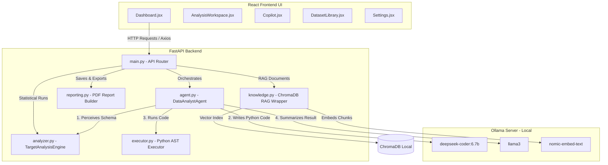

# Analyst.AI: Engineering Design Review & Deep Learning Guide

Welcome to the **Engineering Design Review & Deep Learning Guide** for the Analyst.AI (Data Analyst Agent) project. This guide is written from first principles to help you master, defend, and extend the system during technical interviews, project reviews, or viva examinations.

---

# SECTION 1: SYSTEM-WIDE ENGINEERING PRINCIPLES

## 1. Project Overview & Business Problem

### A. The Business Problem
In modern enterprises, data is stored across various formats, but translating raw datasets into actionable decisions remains slow. The bottleneck is the **Data Analyst Loop**:
1. Business users ask analytical questions (e.g., "Why did this machine fail?" or "Which customer segment is churning?").
2. Data analysts write Python/SQL scripts to parse the data, calculate statistics, and generate plots.
3. Analysts manual-check operator manuals or business documents to contextualize the statistics.
4. Analysts draft a slide deck or PDF report.

This loop takes hours or days. Public AI solutions (like ChatGPT) introduce compliance risks by sending proprietary data to external cloud servers, and they are prone to fabricating statistical metrics (hallucination).

### B. The Analyst.AI Solution
Analyst.AI automates this entire loop locally:
- **Zero-Trust Offline Operation**: Runs all LLM inference and embeddings locally using Ollama and ChromaDB.
- **Dynamic Domain Adaptation**: Automatically profiles the dataset domain (Survival, Maintenance, Growth) and adapts its language and metrics.
- **Perceive-Decide-Act-Explain (PDAE) Loop**: Automatically generates Python code, runs it in an AST-validated sandbox, and explains the results using natural language.
- **Contextual Grounding (RAG)**: Connects data anomalies with uploaded PDF manuals to explain *why* data patterns occur based on company guidelines.

---

## 2. Complete System Architecture



### Architectural Connections & Request-Response Lifecycles
1. **CSV Ingestion**:
   * **Request Flow**: User drags a CSV into the UI $\rightarrow$ Frontend uploads file via `POST /upload` $\rightarrow$ FastAPI validates file size (20MB limit) and extension $\rightarrow$ Pandas parses the stream in-memory and saves the data to the global `DATASTORE["df"]`.
   * **Response Flow**: Returns the detected target column, candidate columns, and a session UUID.
2. **Target & Acronym Confirmation**:
   * **Request Flow**: Frontend triggers `POST /analysis/confirm_target` $\rightarrow$ Backend runs acronym filtering via Ollama.
   * **Response Flow**: Backend returns a list of candidate acronyms (e.g., TPM, OEE) that need definitions before starting the main analysis.
3. **Background Profiling**:
   * **Request Flow**: User submits acronym definitions $\rightarrow$ Frontend calls `POST /analysis/start` $\rightarrow$ Backend sets `profiling_status = "running"` and launches `run_background_profiling_and_analysis` in a background daemon thread.
   * **Response Flow**: Instant `200 OK` response with status `"started"`. The frontend then polls `GET /domain_profile` every 2 seconds until the backend thread completes profiling and sets the status to `"completed"`.
4. **Chat Execution (Copilot)**:
   * **Request Flow**: User asks a question $\rightarrow$ Frontend sends query to `POST /chat` $\rightarrow$ Backend runs the PDAE loop:
     * `SchemaAgent` extracts columns and correlations.
     * `CodeGeneratorAgent` uses `deepseek-coder:6.7b` to write Pandas code.
     * `ExecutorAgent` runs `executor.py` to validate and execute the code.
     * `InsightAgent` queries `llama3` to explain the output.
   * **Response Flow**: Returns structured JSON containing the analysis markdown, evidence columns, confidence score, visualization suggestion, recommendations, and reasoning steps.

---

# SECTION 2: MODULE-BY-MODULE DEEP DIVE

---

## MODULE 1: FastAPI Web Router (`backend/main.py`)

### 1. What it is
The central routing and web gateway for the entire application, implemented using FastAPI.

### 2. Why it exists & is needed
It provides the REST API endpoints that the React frontend queries, manages the application's global memory state (`DATASTORE` and `ANALYSIS_CACHE`), and launches background worker threads.

### 3. Why this approach was chosen
FastAPI was selected for its native support for asynchronous requests, automated OpenAPI documentation generation, and performance (built on Starlette and Uvicorn).

### 4. Alternatives & Why Rejected
* **Flask**: Rejected because it is synchronous by default, does not include built-in Pydantic validation, and requires third-party plugins for OpenAPI generation.
* **Django**: Rejected as too heavy for a simple local model-serving backend, introducing unnecessary ORM and migrations overhead.

### 5. Advantages & Limitations
* **Advantages**: High performance, strict type checking via Pydantic, and fast request-response cycles.
* **Limitations**: Storing session state in a global in-memory dictionary (`DATASTORE`) causes collisions if multiple users access the app concurrently.

### 6. Trade-offs
* **Trade-off**: Memory vs. Storage. Using an in-memory dictionary makes data access extremely fast and simplifies local single-user setup, but it prevents the backend from scaling horizontally across multiple server instances.

### 7. Real-world applications
Highly responsive microservices, machine learning model APIs, and IoT data routing gateways.

### 8. Interview Q&A
* **Q**: How does FastAPI's dependency injection work, and where is it used?
* **A**: FastAPI uses python's `Depends` to declare dependencies that should be executed before running a route handler. In this application, we use Pydantic models (like `Query` and `ConfirmTargetPayload`) to validate request payloads on entry.
* **Q**: What are the concurrency implications of using raw Python threads inside a FastAPI endpoint?
* **A**: Python's Global Interpreter Lock (GIL) limits CPU-bound execution to a single thread at a time. Spawning raw threads (like `threading.Thread(target=...)`) for heavy LLM operations can cause CPU congestion if multiple requests arrive at once. In production, we should offload these tasks to Celery workers.

---

## MODULE 2: DataAnalystAgent Orchestrator (`backend/agent.py`)

### 1. What it is
The central controller class (`DataAnalystAgent`) that orchestrates the sub-agents and manages the connection parameters for local Ollama models.

### 2. Why it exists & is needed
It coordinates the sub-agents to complete the Perceive-Decide-Act-Explain (PDAE) loop, ensuring that schema context, generated code, execution outputs, and natural language explanations flow smoothly between the components.

### 3. Why this approach was chosen
A multi-agent design allows us to isolate tasks. A coder agent uses a code model, a reasoning agent uses a chat model, and a normalizer agent cleans the output, which maximizes the accuracy of each step.

### 4. Alternatives & Why Rejected
* **Single monolithic agent**: Rejected because a single prompt asking an LLM to "write code, run it, and explain it" leads to formatting issues and increases hallucinations.

### 5. Advantages & Limitations
* **Advantages**: Easy to debug, modular, and lets us use specialized models for different tasks (e.g., DeepSeek for coding, Llama-3 for explanations).
* **Limitations**: Multiple agent turns increase total request latency because each LLM call runs sequentially.

### 6. Trade-offs
* **Trade-off**: Modularity vs. Latency. The multi-agent pipeline is much more reliable and accurate, but it requires multiple API calls to Ollama, which increases overall response latency compared to a single-prompt approach.

### 7. Real-world applications
Automated software development pipelines, customer service triage agents, and complex document processing systems.

### 8. Interview Q&A
* **Q**: Why does the orchestrator split tasks between `deepseek-coder:6.7b` and `llama3`?
* **A**: DeepSeek is specifically trained on code repositories, making it highly accurate at writing syntax-correct Pandas operations. Llama-3 is a general chat model optimized for conversational reasoning, which makes it better suited for writing explanations and summaries.

---

## MODULE 3: TargetAnalysisEngine (`backend/analyzer.py`)

### 1. What it is
The statistical calculations engine that performs EDA, outlier detection, category breakdowns, and Pearson correlation matrices on pandas DataFrames.

### 2. Why it exists & is needed
It calculates deterministic statistics (like row/column counts, null counts, duplicate records, outliers, and feature correlations) so the application can render telemetry data instantly without calling the LLM.

### 3. Why this approach was chosen
Using NumPy and Pandas for direct statistical calculations guarantees that the baseline numbers shown on the dashboard are 100% accurate, eliminating the risk of LLM calculation hallucinations.

### 4. Alternatives & Why Rejected
* **LLM-calculated statistics**: Rejected because LLMs are bad at performing exact mathematical calculations on large datasets.
* **SQL Database queries**: Rejected because we are building a local file-based analysis tool where loading data into an in-memory Pandas DataFrame is much faster.

### 5. Advantages & Limitations
* **Advantages**: Instant execution speed, zero hallucination risk for numbers, and handles both classification and regression targets.
* **Limitations**: Pearson correlation only detects linear relationships, meaning it can miss complex non-linear patterns.

### 6. Trade-offs
* **Trade-off**: Simplicity vs. Complexity. Pearson correlation is simple and fast to run, but it is less comprehensive than advanced techniques like Mutual Information or Random Forest feature importances.

### 7. Real-world applications
Data profiling dashboards, anomaly detection sensors, and automated data quality checks.

### 8. Interview Q&A
* **Q**: How does the engine detect outliers, and what are the limitations of this method?
* **A**: The engine uses the Interquartile Range (IQR) method: $IQR = Q_3 - Q_1$. Outliers are defined as values outside $[Q_1 - 1.5 \times IQR, Q_3 + 1.5 \times IQR]$. A key limitation is that IQR evaluates each feature independently, meaning it can miss multivariate outliers (which would require algorithms like Isolation Forest).

---

## MODULE 4: AST Python Executor (`backend/executor.py`)

### 1. What it is
A validated Python execution sandbox that sanitizes, verifies, and runs LLM-generated code.

### 2. Why it exists & is needed
Running LLM-generated code dynamically using `exec()` is highly dangerous because a compromised model or malicious prompt could execute commands on the host machine. This module acts as a security guard to validate and run code safely.

### 3. Why this approach was chosen
It uses a multi-layered validation pipeline:
1. Replaces smart quotes.
2. Extracts code blocks.
3. Checks a blacklist of forbidden terms (e.g., `os`, `sys`, `subprocess`, `open`).
4. Validates code syntax using Python's Abstract Syntax Tree (`ast.parse()`) before execution.
5. Runs code inside a restricted local scope.

```
 LLM Code String
      │
      ▼
[Sanitization] ──► Removes smart quotes & markdown blocks
      │
      ▼
[Blacklist]    ──► Rejects forbidden terms (os, subprocess, eval, open)
      │
      ▼
[AST Parsing]  ──► Rejects code if syntax validation fails
      │
      ▼
[Scope Gating] ──► Executes code with local scope limited to {"df", "pd", "np"}
```

### 4. Alternatives & Why Rejected
* **Raw `eval()` or `exec()`**: Rejected because it allows arbitrary command execution on the host server.
* **Docker Container Sandboxing**: Excellent for production, but was rejected for the local workstation prototype to avoid requiring users to install Docker.

### 5. Advantages & Limitations
* **Advantages**: Catches syntax errors before running the code, and blocks basic command injection attempts.
* **Limitations**: The blacklist check can be bypassed using obfuscation (e.g., `getattr(importlib.import_module('o' + 's'), 'system')`). It is not a secure sandbox for multi-tenant cloud deployments.

### 6. Trade-offs
* **Trade-off**: Security vs. Simplicity. AST validation and blacklists are easy to implement locally without external dependencies, but they provide less protection than a true virtualized Docker sandbox.

### 7. Real-world applications
Online code editors, interactive Jupyter notebooks, and AI agents that write and test their own code.

### 8. Interview Q&A
* **Q**: Why is `ast.parse()` used in the validation pipeline?
* **A**: `ast.parse()` compiles the code string into an Abstract Syntax Tree without executing it. This allows the backend to catch syntax errors and inspect the structure of the code before running it, preventing runtime crashes.

---

## MODULE 5: RAG & Vector Database (`backend/knowledge.py`)

### 1. What it is
A Retrieval-Augmented Generation (RAG) module that loads PDF manuals, indexes them in a local ChromaDB vector store, and retrieves relevant chunks.

### 2. Why it exists & is needed
It provides domain-specific knowledge to the LLM. If the user asks about a specific data anomaly, the system retrieves relevant guidelines from the operator manuals to help the LLM write a grounded explanation.

### 3. Why this approach was chosen
It uses `nomic-embed-text` embeddings and ChromaDB to run the entire pipeline locally, maintaining data privacy without calling external APIs.

### 4. Alternatives & Why Rejected
* **Fine-Tuning the LLM**: Rejected because fine-tuning is computationally expensive, requires massive datasets, and cannot be updated dynamically when a user uploads a new manual.
* **Passing Entire PDFs in Prompt**: Rejected because manuals are too large and would exceed the model's context window.

### 5. Advantages & Limitations
* **Advantages**: Runs entirely offline, allows instant updates when new manuals are uploaded, and grounds model responses to prevent hallucinations.
* **Limitations**: Search accuracy depends on semantic chunking and embedding quality, which can sometimes miss context from tables or images.

### 6. Trade-offs
* **Trade-off**: Chunk Size vs. Context. Smaller chunks (1000 characters) capture precise semantic matches, but they can lose the broader context of the document.

### 7. Real-world applications
Enterprise search tools, automated customer support referencing product manuals, and compliance auditing engines.

### 8. Interview Q&A
* **Q**: What is the difference between RAG and Fine-Tuning?
* **A**: RAG acts like an "open-book" exam: the model retrieves relevant excerpts from a database and uses them to answer the question. Fine-tuning is like "studying for the exam": it updates the model's internal weights to learn new styles or domains. RAG is better for incorporating dynamic, proprietary documents.

---

## MODULE 6: PDF Report Generator (`backend/reporting.py`)

### 1. What it is
A reporting component that compiles markdown analyses into printable, styled PDF files using ReportLab.

### 2. Why it exists & is needed
Business leaders and operators need printable, professional, and structured summaries of data drivers and recommendations. This module converts LLM markdown text into formatted PDF reports.

### 3. Why this approach was chosen
ReportLab provides low-level control over PDF layouts, allowing us to build custom title blocks, metadata tables, horizontal dividers, and clean typography.

### 4. Alternatives & Why Rejected
* **HTML-to-PDF converters** (e.g., `Weasyprint`): Rejected because they require running external rendering engines, which increases dependencies and CPU overhead on local machines.

### 5. Advantages & Limitations
* **Advantages**: Generates compact, high-resolution PDFs directly from Python memory streams without saving intermediate files.
* **Limitations**: Designing complex layouts requires writing verbose Python code, as ReportLab does not support standard CSS styling.

### 6. Trade-offs
* **Trade-off**: Design control vs. Development speed. ReportLab requires manual layout definition, which takes more effort to build than HTML templates but results in highly consistent, dependency-free PDFs.

### 7. Real-world applications
Automated invoicing systems, banking statement generators, and analytics export engines.

### 8. Interview Q&A
* **Q**: How does the report generator handle markdown text formatting?
* **A**: The module uses regular expressions to convert markdown syntax (like `**bold**`, `*italic*`, and `code`) into HTML-like tags (`<b>`, `<i>`, `<font face="Courier">`) supported by ReportLab's `Paragraph` class.

---

## MODULE 7: Deterministic Output Normalizer (`backend/normalizer.py`)

### 1. What it is
A text post-processor that cleans generated summaries to keep report sections separate.

### 2. Why it exists & is needed
LLMs often overlap information across report sections (e.g., discussing mitigation strategies in the root cause section). This module uses rule-based filtering to enforce boundaries between **Drivers (Why)**, **Impact (What)**, and **Actions (How)**.

### 3. Why this approach was chosen
A deterministic, rule-based approach is fast and guarantees compliance with layout constraints without running a second, expensive LLM cleaning pass.

### 4. Alternatives & Why Rejected
* **LLM-based cleaning**: Rejected because it increases API latency and cost, and still carries a risk of hallucinating or ignoring formatting instructions.

### 5. Advantages & Limitations
* **Advantages**: Fast, zero execution cost, and guarantees that specific forbidden terms do not cross over between sections.
* **Limitations**: It uses static rules and keyword filters, which can accidentally strip valid sentences if they contain blocked words.

### 6. Trade-offs
* **Trade-off**: Execution cost vs. Semantic intelligence. Rule-based filters are fast and deterministic, but they lack the semantic understanding of an LLM.

### 7. Real-world applications
Data sanitization pipelines, content filtering systems, and automated formatting validators.

### 8. Interview Q&A
* **Q**: Why does `normalizer.py` use list checks instead of regex for forbidden words?
* **A**: List checks are simpler and faster for matching basic forbidden terms. However, using regex would allow us to match word boundaries more accurately and prevent false positives (e.g., blocking "prevent" shouldn't block "preventative").

---

# SECTION 3: ENGINEERING DECISION DICTIONARY

This section details the design rationale behind every technology choice in the system.

### Why React instead of Streamlit or HTML/JS?
* **First Principles**: React is a component-driven framework that uses a Virtual DOM to update the UI efficiently.
* **Why chosen**: Streamlit is great for simple prototypes, but it re-runs the entire script on every user interaction, making it slow for complex dashboards. React allows us to manage complex state transitions (like showing the target column modal or polling status) without re-rendering the whole page.
* **Analogy**: Streamlit is like rebuilding a house every time you change a lightbulb. React is like changing just the bulb.
* **Interview Expectation**: Explain React's state hooks and why Virtual DOM diffing is faster than direct DOM manipulation.

### Why FastAPI instead of Flask?
* **First Principles**: FastAPI uses Python type hints and Pydantic to validate data schemas automatically.
* **Why chosen**: It supports asynchronous concurrency (`async/await`) out of the box, whereas Flask requires complex configurations for async routes. It also auto-generates interactive API docs.
* **Analogy**: Flask is like a manual entry log where you have to check everyone's ID yourself. FastAPI is like an electronic turnstile that validates tickets automatically.
* **Interview Expectation**: Explain Starlette, Uvicorn, ASGI vs. WSGI, and how Pydantic handles request validation.

### Why Python?
* **First Principles**: Python is the standard language for data science and AI workflows.
* **Why chosen**: It provides native integrations for libraries like Pandas, NumPy, Scikit-Learn, and PyTorch, which are required for data analysis and machine learning.
* **Analogy**: Python is the universal translator for both data libraries and LLM frameworks.

### Why LangChain?
* **First Principles**: LangChain is an orchestration framework for LLM-powered applications.
* **Why chosen**: It simplifies building RAG pipelines by providing pre-built integrations for document loaders (`PyPDFLoader`), text splitters, and vector store connectors.
* **Analogy**: LangChain is like a modular scaffolding kit for connecting LLMs to data sources.

### Why ChromaDB instead of FAISS or Pinecone?
* **First Principles**: ChromaDB is an open-source, developer-friendly vector database.
* **Why chosen**: Unlike Pinecone (which is cloud-hosted and requires external network calls), ChromaDB runs locally, keeping all data secure. Unlike FAISS (which is just an in-memory index), ChromaDB supports metadata filtering and persistent storage.
* **Analogy**: Pinecone is a public storage locker down the street. ChromaDB is a safe inside your office.
* **Interview Expectation**: Explain vector embeddings, distance metrics (Cosine vs. Euclidean), and index persistence.

### Why Ollama instead of OpenAI API?
* **First Principles**: Ollama is a local model runner that exposes a standardized HTTP API.
* **Why chosen**: Running models locally keeps sensitive user datasets secure and offline, eliminating subscription costs and rate limits.
* **Analogy**: OpenAI is like hiring a consultant whom you must pay for every question. Ollama is like buying a book that you can read as much as you want.
* **Interview Expectation**: Explain the trade-offs of local models (VRAM constraints, local hardware costs) vs. API-hosted models.

### Why a Multi-Agent Architecture instead of a Single LLM?
* **First Principles**: Multi-agent architectures split complex workflows into smaller, specialized roles.
* **Why chosen**: A single prompt asking an LLM to "analyze, write code, run it, and explain it" often fails. Splitting this into specialized agents (Schema, Coder, Executor, Insighter) makes the system much more reliable.
* **Analogy**: A single LLM is a general practitioner trying to perform heart surgery. A multi-agent system is a specialized surgical team.

---

# SECTION 4: DEEP LEARNING & MATHEMATICS GUIDE

This section explains the core mathematical concepts and algorithms used in the data analysis and RAG pipelines.

## 1. Pearson Correlation Coefficient ($r$)

### A. Definition
A metric that measures the linear relationship between two variables. It ranges from $-1$ (perfect negative correlation) to $+1$ (perfect positive correlation).

### B. Mathematical Formula
$$r = \frac{\sum_{i=1}^{n} (x_i - \bar{x})(y_i - \bar{y})}{\sqrt{\sum_{i=1}^{n} (x_i - \bar{x})^2 \sum_{i=1}^{n} (y_i - \bar{y})^2}}$$
Where:
* $x_i, y_i$ are individual data points.
* $\bar{x}, \bar{y}$ are the mean values of the variables.

### C. Implementation in Code
```python
corrs = df[numeric_cols].corrwith(target_series)
```

### D. Analogy
It is like measuring how closely two dancers follow each other's movements. If one steps forward and the other moves back in sync, that is a perfect correlation.

---

## 2. Cosine Similarity (Vector Space Search)

### A. Definition
Measures the cosine of the angle between two vectors in a multi-dimensional space, evaluating how similar they are in direction regardless of scale.

### B. Mathematical Formula
$$\text{Cosine Similarity} = \cos(\theta) = \frac{\mathbf{A} \cdot \mathbf{B}}{\|\mathbf{A}\| \|\mathbf{B}\|} = \frac{\sum_{i=1}^{n} A_i B_i}{\sqrt{\sum_{i=1}^{n} A_i^2} \sqrt{\sum_{i=1}^{n} B_i^2}}$$

### C. Implementation in Code
ChromaDB uses this formula to compare the user's query vector with the document chunk vectors stored in the index.

### D. Analogy
It is like comparing the direction of two arrows. If they point in the same direction, the similarity is $1$, even if one arrow is much longer than the other.

---

## 3. Interquartile Range (IQR) for Outlier Detection

### A. Definition
A measure of statistical dispersion, calculated as the difference between the 75th percentile ($Q_3$) and the 25th percentile ($Q_1$).

### B. Mathematical Formulas
$$\text{IQR} = Q_3 - Q_1$$
$$\text{Lower Bound} = Q_1 - 1.5 \times \text{IQR}$$
$$\text{Upper Bound} = Q_3 + 1.5 \times \text{IQR}$$

### C. Implementation in Code
```python
Q1 = df[col].quantile(0.25)
Q3 = df[col].quantile(0.75)
IQR = Q3 - Q1
outliers = df[(df[col] < Q1 - 1.5*IQR) | (df[col] > Q3 + 1.5*IQR)]
```

### D. Analogy
It is like defining the "normal" height range for a group. If most people are between 5'0" and 6'0", anyone under 3'9" or over 7'3" is classified as an outlier.

---

# SECTION 5: STEP-BY-STEP DATA FLOW PIPELINE

Below is the step-by-step lifecycle of data flowing through the system:

```
[User CSV File]
      │
      ▼ (POST /upload)
[FastAPI Ingestion] ──► Checks size (<20MB) & extension. Sanitizes headers.
      │
      ▼ (POST /analysis/confirm_target)
[Target Selector]   ──► User confirms target. Acronyms filtered via Ollama.
      │
      ▼ (POST /analysis/start)
[Background Thread] ──► DomainAgent profiles domain. pre-computes stats.
      │
      ▼ (User Chat Query: POST /chat)
[SchemaAgent]       ──► Maps column types & pre-computed correlations.
      │
      ▼
[Code Generator]    ──► DeepSeek-Coder writes Pandas script matching query.
      │
      ▼
[AST Executor]      ──► Sanitizes code, runs AST syntax parse, and executes via exec().
      │
      ▼
[Knowledge Retrieval]──► Retrieves matching manual chunks from ChromaDB.
      │
      ▼
[Insight Generation]──► Llama3 synthesizes execution result + RAG context.
      │
      ▼
[Normalization]     ──► Output normalizer cleans report layouts.
      │
      ▼
[UI Rendering]      ──► Frontend displays markdown text & updates charts.
```

---

# SECTION 6: SECURITY & PRODUCTION BLUEPRINT

## 1. Security Analysis

### A. Remote Code Execution (RCE)
* **Risk**: The backend uses `exec()` to run LLM-generated code. If an attacker submits a prompt injection that bypasses the blacklist (e.g., using `builtins.__import__`), they could execute malicious commands on the server.
* **Fix**: Run the execution engine inside a sandbox environment (such as a transient, read-only Docker container with network access disabled).

### B. Path Traversal
* **Risk**: During manual uploads, an attacker could upload a PDF named `../../main.py` to overwrite core backend files.
* **Fix**: Use a sanitizer to remove directory qualifiers (e.g., `../`) from filenames before saving.

---

## 2. Production Deployment Blueprint

For enterprise multi-user deployments, the system must transition to a distributed architecture:

```
[Client Browsers]
       │
       ▼ (HTTPS)
   [Nginx Reverse Proxy]
       │
       ▼
   [FastAPI App Nodes]
       │
       ├─► [Redis Session Cache] (Handles session states)
       ▼
   [Celery Worker Queue]
       │
       ├─► [GPU Nodes] (Ollama / VRAM Inference)
       ▼
   [Sandboxed Executor] (Docker container runs exec safely)
```

1. **State Management**: Replace in-memory dictionaries with a shared **Redis** session cache.
2. **Task Queue**: Offload heavy LLM and data analysis tasks to **Celery** workers to prevent thread congestion.
3. **Containerized Execution**: Run the Python executor inside temporary Docker containers.
4. **Data Handling**: Use **Polars** instead of Pandas to process large datasets efficiently.

---

# SECTION 7: INTERVIEW PREPARATION (100 QUESTIONS & ANSWERS)

## Beginner Level (Questions 1 - 25)

### Q1: What is a CSV file?
* **Answer**: CSV stands for Comma-Separated Values. It is a plain text file that stores tabular data, where each line represents a row and columns are separated by commas.
* **Follow-up**: What happens if the data fields contain commas?
* **Answer**: The field must be wrapped in double quotes (e.g., `"Rivera, Alex"`) so parser libraries know it is a single value.

### Q2: What is the purpose of Pandas in Python?
* **Answer**: Pandas is an open-source data manipulation library that provides high-performance data structures (such as `DataFrame` and `Series`) to clean, filter, and analyze tabular data.

### Q3: What is the difference between a Pandas Series and a DataFrame?
* **Answer**: A Series is a 1-dimensional array that holds a single column of data. A DataFrame is a 2-dimensional tabular structure composed of multiple Series (columns) sharing a common index.

### Q4: Why does the system replace smart quotes in the executor?
* **Answer**: Smart quotes (`“`, `”`) are inserted by rich text editors. Python's interpreter does not recognize them as string delimiters, which throws a syntax error. We replace them with standard quotes (`"`, `'`) to ensure the code executes correctly.

### Q5: What does CORS stand for, and why is it configured in FastAPI?
* **Answer**: CORS stands for Cross-Origin Resource Sharing. It is a security mechanism that restricts web browsers from making requests to a different domain than the one that served the web page. We enable it in FastAPI (`allow_origins=["*"]`) so our React frontend (running on port 3000) can communicate with our FastAPI backend (running on port 8000).

### Q6: What is a React component?
* **Answer**: A modular, reusable UI building block that manages its own rendering logic and state, returning JSX elements to build the user interface.

### Q7: What is the difference between `props` and `state` in React?
* **Answer**: `props` are read-only inputs passed down from parent components to child components. `state` is local, private data managed within the component itself that triggers a re-render when updated.

### Q8: What does the `useEffect` hook do in React?
* **Answer**: It allows functional components to perform side effects (such as fetching data from an API, setting up timers, or manually modifying the DOM) after rendering.

### Q9: What is FastAPI's relationship with Pydantic?
* **Answer**: FastAPI uses Pydantic for data parsing, type validation, and documentation. Pydantic models validate incoming request payloads and return clear validation errors if the request body doesn't match the schema.

### Q10: What is an LLM context window?
* **Answer**: The maximum number of tokens (words/characters) the model can process in a single request, including the system prompt, user prompt, and generated response.

### Q11: What is a token in Large Language Models?
* **Answer**: The basic unit of text processed by an LLM, representing a word, sub-word, or character. For example, the word "analyzing" might be split into tokens like "analy" and "zing".

### Q12: Why does the backend use `matplotlib.use('Agg')`?
* **Answer**: By default, Matplotlib attempts to open an interactive GUI window to render plots. Setting the backend to `'Agg'` disables the GUI, allowing the server to render plots directly to memory buffers in a headless environment.

### Q13: What is a vector embedding?
* **Answer**: A mathematical representation of text as a dense vector of numbers, capturing the semantic meaning of the words so similar concepts are located close together in the vector space.

### Q14: What is a Vector Database?
* **Answer**: A database optimized to store, index, and query high-dimensional vector embeddings efficiently, supporting similarity searches based on semantic distance.

### Q15: What is the primary function of the `SchemaAgent`?
* **Answer**: It inspects the uploaded DataFrame to extract column names, data types, and sample records, building a context string that is injected into the LLM prompts.

### Q16: Why is the temperature parameter set to 0.1 for code generation?
* **Answer**: A lower temperature (0.1) reduces randomness, forcing the model to select the most probable tokens. This results in more consistent, syntax-correct code.

### Q17: What does the AST stand for?
* **Answer**: Abstract Syntax Tree. It is a tree representation of the structural syntax of Python source code, allowing program tools to analyze code structure without executing it.

### Q18: What is a markdown code fence?
* **Answer**: A formatting syntax using triple backticks (e.g., ````python ... ````) to highlight code blocks in markdown documents.

### Q19: What is the purpose of `.env` files?
* **Answer**: To store configuration parameters and sensitive credentials (like API keys and model names) outside the source code, keeping them secure and out of version control.

### Q20: What is the difference between classification and regression tasks?
* **Answer**: Classification predicts discrete category labels (e.g., "Survived" vs. "Died"). Regression predicts continuous numeric values (e.g., "Fare" price or "Temperature").

### Q21: What is the role of `Uvicorn` in this project?
* **Answer**: It is an ASGI (Asynchronous Server Gateway Interface) web server implementation that runs our FastAPI application and handles incoming HTTP requests.

### Q22: What does the `n_results` parameter in ChromaDB control?
* **Answer**: It sets the number of relevant document chunks ($k$) to retrieve from the vector database during a similarity search.

### Q23: Why do we strip whitespaces from column headers during upload?
* **Answer**: Leading or trailing spaces in column headers (e.g., `" Age "`) make it difficult for the LLM to reference column names accurately in its generated code, causing key errors.

### Q24: What is the Global Interpreter Lock (GIL) in Python?
* **Answer**: A mutex lock that prevents multiple native threads from executing Python bytecodes at once, limiting CPU-bound tasks to a single core.

### Q25: What is a daemon thread in Python?
* **Answer**: A background thread that runs concurrently with the main program. It does not prevent the main program from exiting and is terminated automatically when the main program stops.

---

## Intermediate Level (Questions 26 - 50)

### Q26: How does the system automatically detect the target column during upload?
* **Answer**: The system uses a heuristic search method (`find_target_column` in `analyzer.py`) that checks the dataset columns against a priority list of common target names (like "Target", "Machine failure", "Survived"). If no match is found, it defaults to selecting the last column.

### Q27: Why does the backend poll status instead of using WebSockets?
* **Answer**: Polling via standard GET requests is simple to implement and does not require maintaining persistent connections, which is suitable for a local single-user prototype. In production, WebSockets or Server-Sent Events (SSE) should be used for real-time updates.

### Q28: How does `clean_for_json` handle Python float conversions?
* **Answer**: Python floats like `NaN` and `Infinity` are not valid in JSON. The function recursively walks dictionaries and lists, replacing `NaN` or `inf` with `None`, and converts numpy types to native Python types.

### Q29: Explain the difference between Euclidean distance and Cosine similarity.
* **Answer**: Euclidean distance measures the straight-line distance between two points in vector space, which is sensitive to vector length. Cosine similarity measures the angle between vectors, evaluating semantic direction regardless of text length.

### Q30: What is Pydantic's role in security validation?
* **Answer**: Pydantic validates incoming request payloads against defined schemas, rejecting invalid data structures before they reach the controller logic and preventing basic injection payloads.

### Q31: How does the system handle acronyms that are not defined by the user?
* **Answer**: If the user skips acronym definition, the system falls back to a DuckDuckGo web search to find definitions in the context of the target variable. If that fails, it profiles without a semantic definition.

### Q32: What are the risks of using Python's `exec()` function?
* **Answer**: `exec()` runs code strings dynamically. If an attacker bypasses the syntax filters, they can run arbitrary OS commands, read environment variables, or delete system files on the host server.

### Q33: How does the system split PDF files for the vector database?
* **Answer**: It uses `RecursiveCharacterTextSplitter` with a chunk size of 1000 characters and a chunk overlap of 200 characters, splitting by double newlines, single newlines, and spaces to keep paragraphs intact.

### Q34: What is the purpose of the `AnimatePresence` wrapper in Framer Motion?
* **Answer**: It allows React components to animate as they exit the DOM tree, ensuring smooth exit transitions when switching between login and registration panels.

### Q35: How does the system generate the executive report system prompt?
* **Answer**: The backend evaluates the classified domain from the domain profile. Based on keyword matches (e.g., "failure", "survived"), it selects the appropriate prompt template containing domain-specific terminology rules.

### Q36: Why does the system require a confirmed target column before running analysis?
* **Answer**: The target column determines the analytical logic. Knowing the target column allows the system to run classification (calculating positive rates and feature shifts) or regression (calculating outliers and driver correlations).

### Q37: How is the chat history persisted across page refreshes?
* **Answer**: The React frontend serializes the chat history, pinned insights, and recent questions, saving them in `localStorage` under keys mapped to the dataset ID (`copilot_memory_{dataset_id}`).

### Q38: What is the purpose of the `ast.parse()` check in `executor.py`?
* **Answer**: It parses the generated Python code string into an Abstract Syntax Tree to verify syntax correctness. If syntax errors exist, it extracts the offending line and returns a clean error message to the user instead of crashing the server.

### Q39: What is the role of `OllamaEmbeddings`?
* **Answer**: It acts as a wrapper that sends document text chunks to the local Ollama server's `/api/embeddings` endpoint, returning 384-dimensional dense vector representations using `nomic-embed-text`.

### Q40: How does the `normalizer.py` prevent semantic leakage?
* **Answer**: It checks lines in the generated text against a blacklist of forbidden terms for each section. For example, it strips "mitigation" or "repair" sentences from the Root Cause section, keeping the sections separate.

### Q41: Explain how the system calculates the percentage shift of numeric features.
* **Answer**: It segments the data into target (e.g., failures) and non-target populations, calculates the mean of the feature for both groups, and computes the percentage change:
$$\% \text{ Shift} = \frac{\mu_{\text{target}} - \mu_{\text{normal}}}{\mu_{\text{normal}}} \times 100$$

### Q42: What is the role of `MockEmbeddings` in the test suite?
* **Answer**: When running test configurations (`TESTING=true`), it generates mock 384-dimensional vectors containing all zeros, allowing tests to run without depending on an active local Ollama server.

### Q43: How does the application prevent browser caching of API responses?
* **Answer**: A custom HTTP middleware intercepts GET requests to dynamic endpoints and appends HTTP headers (`Cache-Control: no-cache`, `Pragma: no-cache`, `Expires: 0`), forcing the browser to retrieve fresh data.

### Q44: What are the security risks of directory traversal in manual uploads?
* **Answer**: If the uploaded filename (e.g., `../../main.py`) is joined directly to the save directory, it can navigate out of the manuals folder and overwrite core backend code. We mitigate this using a filename sanitizer.

### Q45: Explain how the `DomainAgent` returns structured JSON outputs.
* **Answer**: The system prompt instructs the model to return *only* a JSON object matching the requested schema. The backend then extracts the JSON substring using bracket indexes (`{` and `}`) and parses it.

### Q46: What is the role of `reportlab.platypus`?
* **Answer**: Platypus is a high-level page layout library for ReportLab. It provides layout flowables (like `Paragraph`, `Spacer`, `Table`) that handle document page-breaks automatically.

### Q47: Why does the system use a 5-second rate limit on the `/chat` endpoint?
* **Answer**: Running LLMs locally is resource-intensive. The rate limit prevents users from spamming requests and overloading the host's GPU/CPU.

### Q48: How does the `CodeGeneratorAgent` handle conversational queries?
* **Answer**: If the user's question contains words like "explain" or "summary", the agent skips code generation and returns `NO_DATA_ANALYSIS_REQUIRED`, routing the query directly to the explanation agent.

### Q49: What is the purpose of `matplotlib.use('Agg')`?
* **Answer**: It configures Matplotlib to run in a non-interactive backend mode, preventing it from trying to open a GUI window on the host OS when generating dashboard plots.

### Q50: How does the system handle multi-class target columns?
* **Answer**: The system treats target columns with 3 to 10 unique values as classification targets, calculating the prevalence and rate for each category.

---

## Advanced Level (Questions 51 - 75)

### Q51: Detail the security flaws of the Python code execution blacklist and how to bypass it.
* **Answer**: A blacklist check (e.g., checking for `import os` or `subprocess`) is insecure because Python provides multiple ways to access built-in functions dynamically. For example, an attacker can bypass the filters using string concatenation:
```python
getattr(importlib.import_module('o' + 's'), 'system')('rm -rf /')
```
To secure this, the code must be run inside a sandboxed environment like a Docker container.

### Q52: What is the Global Interpreter Lock (GIL) and how does it affect the FastAPI request lifecycle?
* **Answer**: The GIL limits Python bytecodes to executing on a single thread at a time. If a FastAPI route performs a heavy CPU-bound task (such as running statistical correlations on a large DataFrame), it will block all other request threads. We mitigate this by using asynchronous route definitions and offloading CPU-heavy tasks to background threads or Celery.

### Q53: Describe the state reconciliation bug in `renderDashboard()` in `Dashboard.jsx`.
* **Answer**: The dashboard has an early-return check: `if (!data) return <Upload />`. Because `data` is set to `null` on upload start, the component returns early, which prevents the Target Confirmation Modal from rendering. Refreshing the browser fixes this by reloading the EDA data, populating `data`, and bypassing the early return.

### Q54: Explain the differences between ChromaDB, FAISS, and Pinecone.
* **Answer**: 
  - **ChromaDB**: An open-source vector database that runs locally, making it ideal for offline deployments.
  - **FAISS**: An in-memory vector index library by Meta. It is extremely fast for similarity searches but lacks metadata filtering and persistent storage.
  - **Pinecone**: A cloud-hosted vector database. It scales well but requires sending data over the network, introducing data privacy risks.

### Q55: How would you scale the state management from the local `DATASTORE` dictionary to a cloud environment?
* **Answer**: We would migrate state management to **Redis** for session caches and store metadata in a relational database (like PostgreSQL). The React client would include a session token in its HTTP headers, and the backend would load the corresponding session state from the database.

### Q56: How does the `RecursiveCharacterTextSplitter` split documents?
* **Answer**: It splits documents using a list of separator characters (typically double newlines `\n\n`, single newlines `\n`, and spaces ` `) in order. It tries to split text at the highest level separator first, keeping paragraphs and sentences together within the chunk size limit.

### Q57: What is the mathematical definition of Cosine Similarity and how does it apply to RAG?
* **Answer**: Cosine similarity measures the angle between two vectors:
$$\text{Similarity} = \frac{\mathbf{A} \cdot \mathbf{B}}{\|\mathbf{A}\| \|\mathbf{B}\|}$$
In RAG, ChromaDB converts the user's query and the document chunks into vectors. The chunks with the highest cosine similarity are retrieved as the most semantically relevant context for the query.

### Q58: Detail the file validation pipeline in `backend/main.py`'s `/upload` endpoint.
* **Answer**: 
  1. Checks if the extension ends with `.csv`.
  2. Measures file size using `seek` and `tell` (blocking uploads over 20MB).
  3. Tries to parse the first two rows with Pandas to verify headers.
  4. Sanitizes column headers by stripping whitespaces.
  5. Clears active datastore states.

### Q59: Why does the system use a background thread for profiling instead of running it synchronously?
* **Answer**: Domain profiling requires calling a local LLM, which can take several seconds to generate a response. Running it synchronously would block the HTTP response and cause the UI to freeze. Running it in a background thread allows the frontend to show a loading state while polling status.

### Q60: Explain how `ast.parse()` detects syntax errors in generated code.
* **Answer**: `ast.parse(code)` attempts to build an abstract syntax tree of the code. If the code contains syntax errors (like missing parentheses or invalid indentation), it raises a `SyntaxError` exception. The executor catches this exception, parses the line number, and returns a clean error message.

### Q61: What is the purpose of using a HEAD template check in PDF file uploads?
* **Answer**: Simply checking the file extension (e.g., `.pdf`) is insecure because an attacker can rename a malicious script to `.pdf`. The backend reads the first 4 bytes of the file to verify it matches the PDF signature (`%PDF`) before saving.

### Q62: How does the system handle acronym extraction and definition lookup?
* **Answer**: 
  1. `TargetAnalysisEngine` extracts unique categories from the target variable.
  2. The candidate categories are sent to `filter_acronyms` in `agent.py`, where `llama3` filters out common English words and returns actual acronyms.
  3. The frontend displays a modal asking the user for definitions, saving them to the backend datastore.

### Q63: Describe the visual parallax configuration in `LandingPage.jsx`.
* **Answer**: The hero section uses Framer Motion's `useMotionValue` and `useTransform` hooks to track mouse coordinates. It applies perspective transformations (`rotateX`, `rotateY`, `scale`) to stacked screen images, creating a 3D parallax effect when the mouse moves over the container.

### Q64: Explain the differences between Cosine Similarity and $L_2$ Distance.
* **Answer**: Cosine similarity measures vector direction, which is ideal for text matching since it is not affected by document length. $L_2$ distance measures the straight-line distance between points, which can be skewed by document length.

### Q65: How does the PDF report generator map markdown syntax to ReportLab formatting?
* **Answer**: Since ReportLab does not support markdown, the system uses regular expressions to convert markdown tags into supported HTML-like tags:
  * `**bold**` $\rightarrow$ `<b>bold</b>`
  * `*italic*` $\rightarrow$ `<i>italic</i>`
  * `` `code` `` $\rightarrow$ `<font face="Courier">code</font>`
These formatted strings are then rendered using ReportLab's `Paragraph` flowable.

### Q66: What is the Global Interpreter Lock (GIL) and how does it limit multi-threading?
* **Answer**: The GIL is a mutex lock in the CPython interpreter that ensures only one thread executes Python bytecodes at a time. This prevents multi-threaded Python programs from utilizing multiple CPU cores for CPU-bound tasks (like data processing or machine learning).

### Q67: Describe how the `DomainAgent` extracts dataset metadata.
* **Answer**: The agent passes dataset column names, datatypes, and a 3-row sample to `llama3` with a system prompt instructing it to return a JSON schema detailing the business domain, target column, suggested KPIs, and suggested analytics tasks.

### Q68: How would you secure the `/chat` endpoint against Prompt Injection attacks?
* **Answer**: 
  1. **Strict Input Sanitization**: Strip system-like instructions or delimiters from the user's input.
  2. **System Prompt Gating**: Enforce strict system instructions that take priority over user inputs.
  3. **Output Validation**: Use guardrail models (like Llama Guard) to check if the generated output contains unauthorized information.

### Q69: Explain the memory implications of loading massive CSV files using Pandas.
* **Answer**: Pandas loads the entire dataset into memory and represents text columns as objects, which can consume up to $5\times$ to $10\times$ the file's raw size in RAM. For large datasets, this can cause the system to crash due to Out-of-Memory (OOM) errors.

### Q70: How does the `normalizer.py` file sanitize Root Cause Analysis reports?
* **Answer**: It splits the generated report into lines, checks each line against a list of forbidden terms (like "mitigation", "repair", "prevention"), and removes any lines containing those words to keep the root cause report focused only on causes.

### Q71: What is the purpose of the `get_failure_stats` compatibility mappings?
* **Answer**: The backend was refactored to use a domain-agnostic `TargetAnalysisEngine` instead of a failure-specific tool. To prevent breaking the frontend API contracts, the backend returns both the new generic keys and the old failure-specific keys:
```json
{
  "target_count": 120,
  "failure_count": 120,
  "target_rate": 13.5,
  "failure_rate": 13.5
}
```

### Q72: Explain the routing logic in `Dashboard.jsx`'s `renderDashboard()` method.
* **Answer**: 
  - If `datasetLoading` is true, renders a `DashboardSkeleton` loading screen.
  - If `data` is null (empty state), renders `WelcomeDashboard` with the upload box.
  - If `data` is populated, renders the full `AnalysisWorkspace` dashboard showing the analytics telemetry and charts.

### Q73: What is the function of the `OllamaEmbeddings` class in `knowledge.py`?
* **Answer**: It is a LangChain wrapper that communicates with the local Ollama server's `/api/embeddings` endpoint. It passes text chunks and returns their vector representations using the `nomic-embed-text` model.

### Q74: Why does the code execution scope pass local variables like `{"df": df, "pd": pd, "np": np}`?
* **Answer**: To run the generated Pandas code, the execution scope must have access to the dataset (`df`), Pandas (`pd`), and NumPy (`np`). Passing these in a restricted dictionary limits the execution environment and prevents the code from accessing other backend variables.

### Q75: How does the frontend handle clean user logouts?
* **Answer**: 
  1. Clears local states (`data`, `plots`, `domainProfile`).
  2. Deletes dataset-specific history keys (`copilot_memory_*`) from `localStorage`.
  3. Removes session keys (`isAuthenticated` and `user`).
  4. Redirects the user back to the landing page hero view.

---

## Expert Level (Questions 76 - 100)

### Q76: Design a sandboxed execution environment for running LLM-generated code in a multi-tenant cloud environment.
* **Answer**: 
  * **Architecture**: A pool of lightweight, stateless container runners (using gVisor or AWS Fargate) managed by a task queue (like Celery).
  * **Ingestion**: The API saves the DataFrame to an object store (like S3) and pushes a task to the queue.
  * **Execution**: A runner container boots up with read-only access to the S3 data, executes the code, captures the console outputs, and terminates.
  * **Security**: The container has no network access, a read-only filesystem (except for a temporary `/tmp` directory), and strict memory/CPU limits.

```
 [FastAPI Backend]
         │
         ▼ (Saves DataFrame to S3 & Pushes task)
   [Amazon S3] ◄──► [Celery Task Queue]
                           │
                           ▼
                  [Fargate Worker Node]
                           │
                           ▼
             [gVisor Sandboxed Container]
             - Read-Only S3 access
             - Disabled Internet
             - CPU & Memory constraints
```

### Q77: Why does running Ollama inside a Docker container cause a CUDA initialization failure on Windows, and how do you resolve it?
* **Answer**: Ollama inside a Docker container requires accessing the host's GPU. On Windows, Docker runs inside a WSL2 VM. If the **NVIDIA Container Toolkit** is not installed on the host, or if the container was started without the `--gpus all` flag, the WSL2 VM cannot pass the CUDA calls to the host's GPU driver, causing it to fail back to CPU execution.
**Resolution**: Install the NVIDIA Container Toolkit on the host and start the container with GPU pass-through:
```bash
docker run -d --gpus all -v ollama:/root/.ollama -p 11434:11434 --name ollama ollama/ollama
```

### Q78: Explain how to implement a sliding-window token-based conversational memory pruning system.
* **Answer**: 
  1. Use a tokenization library (like `tiktoken`) matching the target model's vocabulary.
  2. Calculate the token length of the system prompt and the incoming query.
  3. Walk the conversation history backwards, adding messages to the window until the total token count reaches the limit (e.g., 4096 tokens).
  4. Summarize the truncated older history using a fast, smaller model, and prepend the summary to the system prompt as context.

### Q79: How would you optimize the current RAG pipeline to handle scanned PDF manuals or documents containing complex tables?
* **Answer**: 
  1. **OCR Ingestion**: Use an OCR engine (like Tesseract or AWS Textract) to extract text from scanned pages.
  2. **Table Parsing**: Use layout-aware document parsers (like Unstructured or LayoutLM) to isolate tables, converting them to HTML tables or Markdown strings.
  3. **Multi-Vector Retrieval**: Store the raw text chunks in the main vector index, and store the table summaries in a parent document index, linking them back to the source tables.

### Q80: Detail how to implement a secure role-based access control (RBAC) authorization layer on the FastAPI backend.
* **Answer**: 
  1. Define user roles (e.g., Admin, Data Analyst, Viewer) using an enum class.
  2. Authenticate users using JWT tokens containing the user's ID and role.
  3. Create a dependency class `RoleChecker` that parses the JWT token and verifies the user's role before running the route handler:
```python
class RoleChecker:
    def __init__(self, allowed_roles: List[str]):
        self.allowed_roles = allowed_roles
    def __call__(self, token: TokenData = Depends(get_current_user)):
        if token.role not in self.allowed_roles:
            raise HTTPException(status_code=403, detail="Operation not permitted")
```

### Q81: What is the mathematical basis of $L_2$ normalized Cosine Similarity, and how does it speed up vector searches?
* **Answer**: When vectors $\mathbf{A}$ and $\mathbf{B}$ are $L_2$ normalized, their lengths are scaled to $1$ ($\|\mathbf{A}\| = \|\mathbf{B}\| = 1$). This simplifies the Cosine Similarity formula to a simple dot product:
$$\text{Cosine Similarity} = \mathbf{A} \cdot \mathbf{B} = \sum_{i=1}^{n} A_i B_i$$
This optimization allows vector databases (like ChromaDB or FAISS) to skip expensive square root calculations, speeding up similarity searches significantly.

### Q82: Describe the race conditions that can occur in the background profiling thread and how to resolve them.
* **Answer**: 
  * **Problem**: If a user uploads a new dataset while a background profiling thread is still running, both threads might attempt to read and write to the global `DATASTORE` dictionary at the same time, leading to race conditions.
  * **Resolution**: Assign a unique `session_id` to each upload task. The background thread checks the active `dataset_session_id` before saving results:
  ```python
  if DATASTORE.get("dataset_session_id") != session_id:
      return # Discard results from stale session
  ```

### Q83: Explain the limitations of the Python `exec()` global namespace dictionary and how it handles imports.
* **Answer**: When running `exec(code, globals, locals)`, Python executes the code within the context of the provided dictionaries. If the code tries to import a module, Python will load it into the system cache (`sys.modules`). This means blacklist checks must be run *before* execution, as standard imports can still modify global modules.

### Q84: How would you replace the Pearson correlation matrix with a non-linear driver analysis method?
* **Answer**: We would use **Mutual Information (MI)** scores from `scikit-learn`:
```python
from sklearn.feature_selection import mutual_info_classif
mi_scores = mutual_info_classif(df[numeric_cols], df[target_col])
```
Mutual Information measures how much information one variable shares with another, capturing both linear and non-linear relationships.

### Q85: Detail how to build a custom PDF canvas class in ReportLab to handle running headers and footers.
* **Answer**: Create a custom canvas subclass that overrides the page drawing methods:
```python
from reportlab.pdfgen import canvas
class NumberedCanvas(canvas.Canvas):
    def __init__(self, *args, **kwargs):
        super().__init__(*args, **kwargs)
        self._saved_page_states = []
    def showPage(self):
        self._saved_page_states.append(dict(self.__dict__))
        self._startPage()
    def save(self):
        num_pages = len(self._saved_page_states)
        for state in self._saved_page_states:
            self.__dict__.update(state)
            self.draw_page_decorations(num_pages)
            super().showPage()
        super().save()
```
This custom canvas tracks the total page count dynamically, allowing us to print running headers and footers (like "Page X of Y") on every page.

### Q86: What is the impact of VRAM fragmentation on local LLM performance?
* **Answer**: VRAM fragmentation occurs when memory allocation blocks are scattered, leaving gaps of free memory that are too small to allocate new tensors. This forces the model to offload layers to the CPU, which slows down token generation speeds.

### Q87: Explain how to implement a dynamic schema pruning system to fit large datasets into the LLM context window.
* **Answer**: If a dataset has hundreds of columns, passing them all to the prompt will exceed the context window. To optimize this:
  1. Calculate the semantic similarity between the user's query and each column name using text embeddings.
  2. Keep only the top $N$ most similar columns (e.g., top 15 columns) and filter out the rest before building the prompt.

### Q88: How would you refactor `main.py` into a clean, modular structure?
* **Answer**: We would split `main.py` into a modular package structure:
```
backend/
├── app/
│   ├── api/
│   │   ├── endpoints/
│   │   │   ├── upload.py
│   │   │   ├── chat.py
│   │   │   └── settings.py
│   │   └── router.py
│   ├── core/
│   │   ├── config.py
│   │   └── security.py
│   ├── services/
│   │   └── state_manager.py
│   └── main.py
```
This isolates route definitions from business logic and configuration parameters, making the codebase easier to maintain.

### Q89: Why does the system use `ast.parse()` instead of direct regex validation for security checks?
* **Answer**: Regex checks can be bypassed using obfuscation (e.g., dividing strings or using hex codes). `ast.parse()` compiles the code into a tree structure, allowing us to inspect every function call and import statement directly in the tree, which is much more secure.

### Q90: How would you configure Nginx to act as a reverse proxy for FastAPI?
* **Answer**: Create an Nginx server block that forwards requests to the Uvicorn socket:
```nginx
server {
    listen 80;
    server_name analyst.company.ai;
    location /api/ {
        proxy_pass http://127.0.0.1:8000/;
        proxy_set_header Host $host;
        proxy_set_header X-Real-IP $remote_addr;
    }
}
```

### Q91: What are the advantages of using Polars over Pandas for this project?
* **Answer**: Polars is written in Rust and uses Apache Arrow memory layouts. It supports multithreading and lazy evaluation, allowing it to process data up to $10\times$ faster than Pandas and run queries on datasets that are larger than the available RAM.

### Q92: Explain how to build a CI/CD pipeline to deploy this application to production.
* **Answer**: 
  1. **Build**: Use GitHub Actions to run unit tests and compile frontend static assets.
  2. **Package**: Build Docker images for both the frontend and backend, pushing them to a container registry (like ECR).
  3. **Deploy**: Deploy the updated containers to the server pool using Kubernetes or ECS, running database migrations automatically.

### Q93: How would you handle timezone conversions when analyzing date columns?
* **Answer**: The system should parse date columns into timezone-aware datetimes using ISO-8601 formatting:
```python
df[date_col] = pd.to_datetime(df[date_col], utc=True)
```
This converts all datetime values to UTC, ensuring consistent calculations across different user regions.

### Q94: How does the system implement structured JSON output parsing for the chat response?
* **Answer**: The system sends the raw LLM answer and the user query back to `llama3` with a prompt instructing it to extract the data into specific JSON keys. The backend then parses the JSON response, falling back to a structured template if parsing fails.

### Q95: Describe the architectural changes needed to support multi-tenancy.
* **Answer**: 
  1. Add a database table to store tenant metadata and isolate user records.
  2. Scope all database and file storage paths by the tenant's ID: `manuals/tenant_id/` and `reports/tenant_id/`.
  3. Verify the tenant ID from the user's JWT token on every API call.

### Q96: What is the mathematical difference between Pearson, Spearman, and Kendall correlation?
* **Answer**: 
  - **Pearson**: Measures the linear relationship between continuous variables.
  - **Spearman**: Measures the monotonic relationship based on rank order, which is less sensitive to outliers.
  - **Kendall**: Measures the ordinal association between variables based on concordant and discordant pairs, making it more accurate for small datasets.

### Q97: Detail how to configure Prometheus to monitor FastAPI performance metrics.
* **Answer**: Install `prometheus-fastapi-instrumentator` in the backend. This exposes a `/metrics` endpoint that collects requests count, latencies, and error rates, which can be visualized in Grafana dashboards.

### Q98: How would you build a fallback mechanism if the local Ollama server goes down?
* **Answer**: Implement a fallback router in `llm_service.py`. If a request to the Ollama server times out, the backend automatically routes the request to an API-hosted backup model (like OpenAI or Anthropic) using a secondary key stored in `.env`.

### Q99: What are the risks of using standard Python list slicing for conversational memory?
* **Answer**: Python list slicing does not check the token length of the messages. If the conversation contains very long messages, list slicing can still exceed the model's context window, causing requests to fail.

### Q100: Explain how to deploy this application locally using Docker Compose.
* **Answer**: Create a `docker-compose.yml` file that configures three services:
  1. `frontend`: Builds and runs the React production bundle.
  2. `backend`: Runs the FastAPI server using Uvicorn.
  3. `ollama`: Runs the local Ollama instance with GPU pass-through configured.
This allows users to deploy the entire application locally with a single command: `docker-compose up`.
