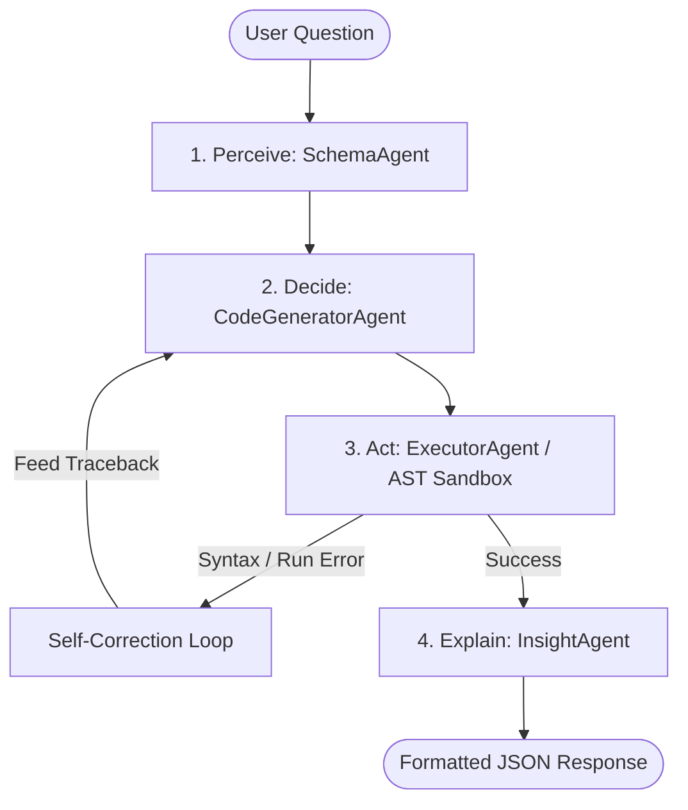

# GenAI Agent Developer Interview Study Guide: Analyst.AI

This guide is designed to prepare you for your GenAI Agents interview. It breaks down **Analyst.AI** (the Data Analyst Agent) from first principles, explaining the technical design, cognitive architecture, and implementation details so you can explain and defend them during your technical reviews.

---

## 1. Executive Project Summary

### The Core Problem
1. **The Data Analyst Bottleneck**: Business stakeholders ask analytical questions. Data analysts must write Python/SQL scripts, calculate statistical correlation, check system operator manuals to explain anomalies, and write report PDFs. This loop takes hours or days.
2. **Data Privacy Risks**: Public LLM APIs (like OpenAI or Anthropic) pose significant compliance risks when uploading proprietary enterprise datasets.
3. **Speculative Hallucinations**: Standard LLMs often hallucinate numbers, correlations, or events when generating narrative summaries from abstract data structures.

### The Analyst.AI Solution
An **offline, local, multi-agent system** that automates the entire analyst workflow:
*   **Zero-Trust Offline Operation**: Runs completely locally using **Ollama** (models served on-premise) and **ChromaDB** (local vector database).
*   **AST-Validated Code Sandbox**: Writes Pandas code, validates it statically via python's `ast` library to catch syntax errors, and runs it safely inside a sandbox.
*   **Domain-Aware Reasoning**: Dynamic profiling automatically classifies the dataset (e.g. Industrial Maintenance, Survival Demographics, or Growth Business) and swaps LLM system prompts to match the vocabulary.
*   **Local RAG Context**: Connects data patterns to proprietary PDF manuals (e.g. machine manuals) to explain *why* statistical failures occur.

---

## 2. Multi-Agent Cognitive Architecture (The PDAE Loop)

The core architecture follows the **Perceive-Decide-Act-Explain (PDAE)** loop, orchestrated sequentially inside [agent.py](file:///d:/Data_Analyst_Agent/backend/agent.py).

### Agent Component Breakdown

| Agent Class | Source Module | Primary Task | LLM Used? |
| :--- | :--- | :--- | :--- |
| **OrchestratorAgent** | [orchestrator_agent.py](file:///d:/Data_Analyst_Agent/backend/agents/orchestrator_agent.py) | Analyzes the query to plan the routing execution plan. | ✅ Yes (`llama3`) |
| **DomainAgent** | [domain_agent.py](file:///d:/Data_Analyst_Agent/backend/agents/domain_agent.py) | Ingests the data structure on upload to profile the semantic domain and recommended KPIs. | ✅ Yes (`llama3`) |
| **SchemaAgent** | [schema_agent.py](file:///d:/Data_Analyst_Agent/backend/agents/schema_agent.py) | Non-LLM agent that inspects dataset dimensions, types, sample rows, and Pearson correlations to construct context. | ❌ No |
| **CodeGeneratorAgent** | [code_generator_agent.py](file:///d:/Data_Analyst_Agent/backend/agents/code_generator_agent.py) | Translates natural language questions and schema contexts into executable Python pandas code. | ✅ Yes (`deepseek-coder:6.7b`) |
| **ExecutorAgent** | [executor_agent.py](file:///d:/Data_Analyst_Agent/backend/executor.py) | Non-LLM agent that cleans code fences, verifies syntax, filters blacklisted imports, and executes python. | ❌ No |
| **InsightAgent** | [insight_agent.py](file:///d:/Data_Analyst_Agent/backend/agents/insight_agent.py) | Takes the raw pandas dataframe results and explains them grounded in the dataset context. | ✅ Yes (`llama3`) |
| **AnalyticsAgent** | [analytics_agent.py](file:///d:/Data_Analyst_Agent/backend/agents/analytics_agent.py) | Computes auto-EDA summaries, IQR outliers, and renders statistical distributions. | ❌ No |
| **KnowledgeAgent** | [knowledge_agent.py](file:///d:/Data_Analyst_Agent/backend/agents/knowledge_agent.py) | Ingests PDF manuals and returns relevant document chunks using local ChromaDB search. | ❌ No |
| **NormalizationAgent** | [normalization_agent.py](file:///d:/Data_Analyst_Agent/backend/agents/normalization_agent.py) | Enforces deterministic boundaries on failure report outputs. | ❌ No |

---

## 3. Key Design Patterns & Code Implementation

### A. The AST-Validated Sandbox & Self-Correction Loop
One of the most common failure modes for code-generating agents is syntax errors or runtime exceptions (e.g. typos in column names). Analyst.AI solves this by implementing a **Self-Correction (Retry) Loop**:

1.  **Code Sanitization**: Strips markdown code blocks and replaces smart quotes.
2.  **AST Verification**: Passes the code through `ast.parse(cleaned_code)` inside [executor.py](file:///d:/Data_Analyst_Agent/backend/executor.py#L99). If a `SyntaxError` is raised, it is caught immediately without running the script.
3.  **Blacklist Checks**: Blocks dangerous actions (e.g. `import os`, `subprocess`, `open`).
4.  **Runtime Execution & Capture**: Runs `exec()` inside a local scope containing `{"df": df, "pd": pd, "np": np}` and checks for a `result` variable.
5.  **Regeneration Feedback**: If the execution fails (either syntax or runtime exception), [agent.py](file:///d:/Data_Analyst_Agent/backend/agent.py#L328-L352) catches the error and feeds the **Failed Code** and the **Error Traceback** back to the `CodeGeneratorAgent`. The generator inspects its error and outputs corrected code (allows up to 3 retries).

### B. Domain-Aware Dynamic Prompting
Instead of using a generic analysis prompt, the system dynamically changes personas based on the dataset domain:

1.  On file upload, the [DomainAgent](file:///d:/Data_Analyst_Agent/backend/agents/domain_agent.py) parses sample records and outputs a JSON profile.
2.  During background analysis, `LLMService` calls [get_executive_report_prompt](file:///d:/Data_Analyst_Agent/backend/agents/llm_service.py#L250-L379) to classify the domain.
3.  It loads one of three specialized templates:
    *   **Demographic & Survival**: Persona is *Senior Demographic & Survival Analyst*. Focuses on survival rates and evacuations; forbids business-centric terms like "revenue impact" or "marketing campaign."
    *   **Predictive Maintenance**: Persona is *Senior Predictive Maintenance & Reliability Engineer*. Focuses on telemetry thresholds and tool wear; forbids demographic and business terms.
    *   **Business & Growth**: Persona is *Senior Business & Growth Analyst*. Focuses on churn, retention, and customer segments.
4.  This design prevents **out-of-domain vocabulary leakage** and maintains high executive credibility.

### C. Offline RAG Pipeline (PDF Grounding)
For queries regarding technical context, the system references local manuals:
*   Uses `PyPDFLoader` to parse manual text.
*   Uses `RecursiveCharacterTextSplitter` to generate overlapping chunks.
*   Computes embeddings using `nomic-embed-text` locally via Ollama.
*   Saves vectors locally to a ChromaDB directory.
*   Features a **MockEmbeddings fallback class** inside [knowledge.py](file:///d:/Data_Analyst_Agent/backend/knowledge.py#L16-L20) to prevent application crashes if Ollama is not running.

---

## 4. Strategic Interview Trade-offs (How to Answer Tough Questions)

### Q: Why build a custom multi-agent sequence instead of using LangChain or CrewAI?
> **Answer**: 
> *   **Zero Dependency Bloat**: Frameworks like LangChain introduce heavy, opinions-based wrappers that change APIs frequently, causing codebase instability.
> *   **Predictable Execution Flow**: For this application, the routing pathway is a fixed, deterministic sequence (Schema $\rightarrow$ Code $\rightarrow$ Execute $\rightarrow$ Explain). Using a complex agent framework adds execution overhead and latency.
> *   **Fine-grained Debugging**: By managing our own `exec()` and AST loops, we can easily capture stack traces and feed them directly into our self-correction logic, rather than relying on abstract framework callbacks.

### Q: Why use two separate local models (`deepseek-coder:6.7b` and `llama3`)?
> **Answer**: 
> *   **Specialization vs. Resource Optimization**: Coding models and reasoning models are trained differently. `deepseek-coder` has a strong structural prior for writing clean Python syntax without conversational filler, making it excellent for the **Sandbox** step. `llama3` excels at conversational reasoning, high-fidelity prose, and following negative prompt constraints, making it perfect for the **Explain** and **Domain Profiling** steps.
> *   **VRAM Allocation**: On small developer workstations (e.g. laptop GPUs like the RTX 3050), running a single huge generalist model is slow. Swapping between smaller, highly-specialized models ensures they fit cleanly in VRAM, giving us 30–60 tokens/sec.

### Q: How does the system guarantee the LLM doesn't make up numbers in the reports?
> **Answer**: 
> We implement a multi-layered validation fence:
> 1.  **Grounded Prompts**: Our system prompts explicitly instruct the model that every number or percentage *must* be extracted from the provided pandas context, enforcing zero speculative estimation.
> 2.  **Deterministic Post-Processing**: The [normalizer.py](file:///d:/Data_Analyst_Agent/backend/normalizer.py) module uses a deterministic rule-based cleaner to remove paragraph text, headings, or lines containing forbidden concepts (e.g. ensuring "action items" do not bleed into the "root cause" section). This code is the ultimate authority—not the LLM.

### Q: What is the GPU CPU Fallback issue and how did you resolve it?
> **Answer**: 
> When running Ollama in isolated WSL2/Docker environments on Windows, Ollama will fallback to CPU execution if the host's CUDA drivers are not exposed. We diagnosed this by analyzing the `CUDA shared object initialization failed` error, identifying a missing **NVIDIA Container Toolkit** or WSL driver mapping. We recommend running Ollama natively on Windows to bypass WSL2 mapping layers, allowing DXGI/CUDA bindings to run models entirely in GPU VRAM (delivering a 6x-9x speedup).

---

## 5. Summary Architectural Walkthrough (Cheat Sheet)

If the interviewer asks: **"Walk me through what happens when a user uploads a CSV and asks a question."**

1.  **Ingestion**: User uploads a file. FastAPI strips column whitespace, guesses the target column using priority heuristics, and returns candidate lists.
2.  **Acronym Filtering**: The backend runs the list of mode candidates through the LLM to identify unknown acronyms (e.g., TPM, OEE) while ignoring standard labels (Age, Fare). The user defines them to ground the semantic context.
3.  **Domain Profiling**: A background thread launches. The `DomainAgent` analyzes column types and sample rows, classifying the dataset domain and recommending KPIs.
4.  **Query Perceive**: User types a question. The `SchemaAgent` extracts columns, dtypes, sample rows, and Pearson correlations to build a context block.
5.  **Query Decide**: The `CodeGeneratorAgent` uses `deepseek-coder` to write a pandas code snippet to resolve the query, storing the result in a `result` variable.
6.  **Query Act**: The `ExecutorAgent` sanitizes the code, checks it using Python's `ast` parser for syntax errors, and validates that it does not import blacklisted libraries. It runs the code inside `exec()`. If it fails, the traceback is fed back for correction (up to 3 retries).
7.  **Query Explain**: The `InsightAgent` takes the string result and uses `llama3` to compile a grounded, natural language response.
8.  **Query Formatting**: The response is structured via LLM schema mapping into a standardized JSON response containing evidence columns, confidence scores, chart suggestions, and a step-by-step reasoning trace.
