# LLM Backend Configuration Audit Report

This report presents the findings of the LLM Backend Configuration Audit, outlining the current routing pathways, verification of OpenAI integration, the root cause of the GPU to CPU fallback on the NVIDIA RTX 3050, and recommended action steps.

---

## 1. Actual Active Backend
Despite the configuration of `LLM_BACKEND=openai` in the `.env` file, the **actual active backend is Ollama**.

* **No OpenAI Logic**: There is no OpenAI integration implemented in the application code. The python packages `openai` is listed as a dependency in `backend/requirements.txt`, but it is never imported or initialized anywhere in the codebase.
* **Hardcoded Ollama Routing**: `backend/agent.py` initializes the `LLMService` using Ollama-specific configuration parameters, and `llm_service.py` directs all calls exclusively to the Ollama server endpoint (`/api/generate`).

---

## 2. Backend Routing Diagram

The sequence diagram below traces the complete call path from the agent down to the LLM backend:

```mermaid
sequenceDiagram
    participant App as main.py / API
    participant Agent as agent.py (DataAnalystAgent)
    participant LLMService as agents/llm_service.py (LLMService)
    participant Ollama as Local Ollama Server (http://localhost:11434)

    Note over App, Ollama: .env specifies LLM_BACKEND=openai (Ignored by code)
    
    App->>Agent: agent.run(question, chat_history)
    
    rect rgb(20, 30, 45)
        Note over Agent: Step 1: Perceive Context
        Agent->>Agent: perceive(question)
    end

    rect rgb(20, 30, 45)
        Note over Agent: Step 2: Decide & Generate Code
        Agent->>Agent: decide(context, question)
        Agent->>LLMService: call_llm(prompt, system_type="code")
        Note over LLMService: Map to code_model ("deepseek-coder:6.7b")<br/>System Prompt: system_prompt_code
        LLMService->>LLMService: call_ollama_with_model(prompt, system_prompt, model)
        LLMService->>Ollama: POST /api/generate (Payload: deepseek-coder:6.7b)
        Ollama-->>LLMService: Return JSON generated code
        LLMService-->>Agent: Cleaned code string
    end

    rect rgb(20, 30, 45)
        Note over Agent: Step 3: Execute Code
        Agent->>Agent: act(code)
    end

    rect rgb(20, 30, 45)
        Note over Agent: Step 4: Explain Findings
        Agent->>Agent: explain(question, result)
        Agent->>LLMService: call_llm(prompt, system_type="analysis")
        Note over LLMService: Map to analysis_model ("llama3")<br/>System Prompt: system_prompt_analysis
        LLMService->>LLMService: call_ollama_with_model(prompt, system_prompt, model)
        LLMService->>Ollama: POST /api/generate (Payload: llama3)
        Ollama-->>LLMService: Return JSON response
        LLMService-->>Agent: Report/Insights text
    end
    
    Agent-->>App: Final Response
```



---

## 3. GPU Root Cause

The fallback to CPU execution (indicated by `ollama ps` showing 100% CPU usage) is caused by **A: Ollama GPU runtime failure**.

### Why the failure occurs:
1. **Container or WSL2 Isolation Mismatch**: The error message `CUDA shared object initialization failed` explicitly refers to a **shared object** (`.so` file) initialization. Because Windows natively uses Dynamic Link Libraries (`.dll`), this indicates Ollama is running within a Linux container (Docker) or a Windows Subsystem for Linux (WSL2) instance.
2. **Missing NVIDIA Container Toolkit / WSL Passthrough**: The Linux version of Ollama inside Docker or WSL2 requires the host driver's library (`libcuda.so.1` or equivalent passthrough mapping) to be exposed to the container environment. If the **NVIDIA Container Toolkit** is missing on the Windows host, or if the container was launched without the `--gpus all` flag, the Linux runtime cannot locate or initialize the CUDA shared library, throwing the initialization error.
3. **num_gpu=-1 is Correct**: The setting `num_gpu=-1` is the correct default configuration for Ollama. It instructs the llama.cpp engine to auto-detect the GPU memory and offload all available layers to it. It does not force CPU mode. Instead, CPU execution is a safe-fallback triggered automatically by Ollama because the CUDA backend failed to start.

---

## 4. Recommended Ollama Configuration

To fix the GPU runtime failure and enable full CUDA acceleration, execute the following steps depending on your environment:

### Option A: If running Ollama inside a Docker Container
Ensure the **NVIDIA Container Toolkit** is installed on your Windows Host and configure Docker to pass GPU access:
1. Install the tool: [NVIDIA Container Toolkit Documentation](https://docs.nvidia.com/datacenter/cloud-native/container-toolkit/latest/install-guide.html).
2. Start the container with GPU allocation:
   ```bash
   docker run -d --gpus all -v ollama:/root/.ollama -p 11434:11434 --name ollama ollama/ollama
   ```

### Option B: If running Ollama directly on WSL2 (Ubuntu)
Update the WSL kernel and ensure library paths include the WSL GPU mount:
1. Open PowerShell on Windows and run:
   ```powershell
   wsl --update
   ```
2. In the WSL shell, ensure the Windows GPU driver directory is added to `LD_LIBRARY_PATH`:
   ```bash
   export LD_LIBRARY_PATH=/usr/lib/wsl/lib:$LD_LIBRARY_PATH
   ```

### Option C: If running Ollama natively on Windows (Recommended)
Running Ollama natively on Windows avoids WSL/Docker mapping layers:
1. Download the native Windows installer from [ollama.com](https://ollama.com/download/windows).
2. Run the installer. Ollama will start automatically in the Windows system tray and expose the exact same endpoint (`http://localhost:11434`) with native DXGI/CUDA bindings.

---

## 5. Recommended Model Configuration

The NVIDIA GeForce RTX 3050 typically features **4GB to 8GB of VRAM** (4GB or 6GB on Laptop GPUs, and 8GB on Desktop versions). The model selections should match the specific VRAM available to prevent VRAM overflow (which forces slow partial CPU offloading):

| GPU VRAM | Recommended Code Model | Recommended Analysis Model | Notes |
| :--- | :--- | :--- | :--- |
| **4GB VRAM** | `qwen2.5-coder:1.5b` (Q4_K_M) | `llama3.2:3b` or `qwen2.5:3b` | Fits entirely in VRAM with sufficient space for KV-cache context. |
| **6GB VRAM** | `qwen2.5-coder:3b` (Q4_K_M) | `llama3.2:3b` or `phi3:mini` | Good balance. Low memory footprint, fast generation. |
| **8GB VRAM** | `qwen2.5-coder:7b` (Q4_K_M) | `llama3:8b` or `gemma2:9b` (Q4_K_M) | Can fit a full 7B/8B model at 4-bit quantization entirely in VRAM. |

> [!TIP]
> Keep the environment variable `OLLAMA_NUM_GPU=-1` in `.env` to let Ollama dynamically offload the maximum layers to VRAM.

---

## 6. Expected Performance on RTX 3050 (GPU vs. CPU)

Once GPU acceleration is fixed, you can expect the following speeds (at Q4_K_M quantization) compared to the current CPU fallback:

| Model Size | Expected Speed on GPU (Native/CUDA) | Current Speed on CPU Fallback | Improvement |
| :--- | :--- | :--- | :--- |
| **0.5B - 1.5B** (e.g. Qwen2.5:1.5b) | **~50 - 90 tokens/sec** | ~10 - 15 tokens/sec | ~5x - 6x speedup |
| **3B** (e.g. Llama3.2:3b) | **~30 - 45 tokens/sec** | ~5 - 8 tokens/sec | ~6x speedup |
| **7B - 8B** (e.g. Llama3:8b) | **~8 - 18 tokens/sec** | ~1 - 3 tokens/sec | ~6x - 9x speedup |

*Running models on the CPU bottlenecked by system RAM bandwidth is extremely slow. Re-enabling GPU acceleration will instantly make the agent interface responsive.*
