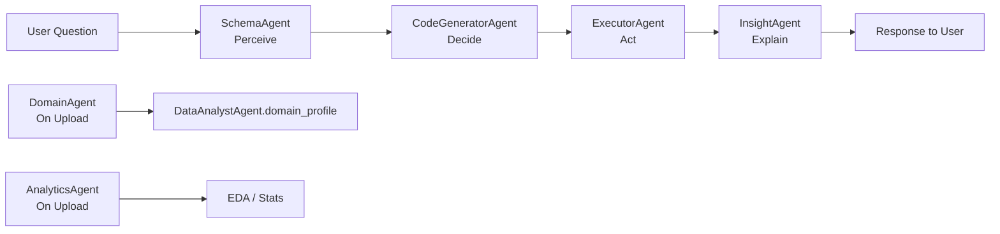

# Multi-Agent Orchestration: Current Architecture & Framework Recommendation

## How Your Orchestration Works Today

Your project implements a **custom, hand-rolled orchestration pattern** — no external framework is used. Here's the full picture:

---

### Architecture: "Linear Sequential Pipeline" (Manual)



The orchestration lives entirely in **[agent.py → DataAnalystAgent.run()](file:///d:/Data_Analyst_Agent/backend/agent.py#L247-L272)**:

```python
def run(self, question: str, chat_history: list = None):
    context = self.perceive(question)        # SchemaAgent
    code    = self.decide(context, question) # CodeGeneratorAgent
    success, result = self.act(code)         # ExecutorAgent
    response = self.explain(question, result) # InsightAgent
    return response
```

---

### Agents and Their Roles

| Agent | File | Role | LLM Used? |
|---|---|---|---|
| **DomainAgent** | [domain_agent.py](file:///d:/Data_Analyst_Agent/backend/agents/domain_agent.py) | Infers dataset domain, target column, KPIs on upload | ✅ Yes |
| **SchemaAgent** | [schema_agent.py](file:///d:/Data_Analyst_Agent/backend/agents/schema_agent.py) | Builds dataframe context (columns, sample, correlations) | ❌ No |
| **CodeGeneratorAgent** | [code_generator_agent.py](file:///d:/Data_Analyst_Agent/backend/agents/code_generator_agent.py) | Generates pandas Python code from user question | ✅ Yes |
| **ExecutorAgent** | [executor_agent.py](file:///d:/Data_Analyst_Agent/backend/agents/executor_agent.py) | Safely runs generated code against the dataframe | ❌ No |
| **InsightAgent** | [insight_agent.py](file:///d:/Data_Analyst_Agent/backend/agents/insight_agent.py) | Converts raw result into natural language explanation | ✅ Yes |
| **AnalyticsAgent** | [analytics_agent.py](file:///d:/Data_Analyst_Agent/backend/agents/analytics_agent.py) | Runs deterministic EDA/stats (auto_eda, plots, correlations) | ❌ No |
| **OrchestratorAgent** | [orchestrator_agent.py](file:///d:/Data_Analyst_Agent/backend/agents/orchestrator_agent.py) | ⚠️ Exists but is a shell — does nothing currently | ❌ No |

---

### What Pattern Is This?

This is a **Perception → Decision → Action → Explanation (PDA+E) loop** — a clean cognitive architecture pattern. It's close to the **ReAct** (Reason + Act) pattern, but simplified:
- **No tool-calling loop** — code is generated and executed once per turn
- **No agent-to-agent messaging** — the orchestrator (`DataAnalystAgent`) calls each sub-agent directly, passing state as plain Python variables
- **No shared memory bus** — state is passed manually via `context`, `result`, `chat_history` arguments

---

## What You Have vs. What Frameworks Provide

| Feature | Your Current System | LangChain | CrewAI |
|---|---|---|---|
| Multi-agent coordination | ✅ Manual, linear | ✅ Graph/Chain-based | ✅ Role-based crew |
| Tool calling / function use | ❌ Not used | ✅ Built-in | ✅ Built-in |
| Memory / persistence | ⚠️ `self.memory = []` (unused) | ✅ ConversationBuffer, VectorStore | ✅ Entity memory |
| Retry / self-correction loops | ❌ Fails silently | ✅ LLMChain retries | ✅ Agent reflection |
| Parallel agent execution | ❌ Sequential only | ✅ Via LCEL/async | ✅ Parallel crew tasks |
| Streaming output | ❌ Not present | ✅ Built-in | ✅ Partial |
| Observability / tracing | ❌ Only print() logs | ✅ LangSmith | ✅ CrewAI logs |
| Model provider abstraction | ⚠️ Ollama only (hardcoded) | ✅ Any LLM | ✅ Any LLM |
| Prompt templating | ⚠️ f-strings only | ✅ PromptTemplate | ✅ Agent role prompts |

---

## Honest Assessment: Should You Switch?

### ✅ Reasons to STAY with your current approach

1. **It works well for your use case.** Your pipeline is a fixed, deterministic sequence: Schema → Code → Execute → Explain. It doesn't need dynamic agent routing.
2. **Zero dependencies on opinionated frameworks.** LangChain has a history of breaking API changes between versions.
3. **Full visibility and control.** You can debug every line — no hidden framework magic.
4. **Low latency.** No framework overhead — each LLM call is a direct HTTP request to Ollama.
5. **The `OrchestratorAgent` is a placeholder** — there's room to grow this naturally without a framework.

### ⚠️ Reasons to consider a framework LATER

1. **Self-correction loop is missing.** If generated code fails, it returns an error. LangChain/LangGraph can retry with error feedback automatically.
2. **`self.memory = []` is unused.** You have no real memory system — a framework gives you this out-of-the-box.
3. **Scaling to more agents becomes complex.** If you add 5+ agents with conditional routing (e.g., "is this a forecasting question? → call ForecastAgent"), managing that in plain Python gets messy fast.
4. **No observability.** You rely on `print()` statements. LangSmith (LangChain) gives you full trace trees.

---

## My Recommendation

> **Stay where you are for now — but add ONE specific upgrade to your current system.**

Your architecture is production-quality for its current scope. The biggest gap is the **missing self-correction loop** when code execution fails. Add this natively first:

```python
# In DataAnalystAgent.run() — add a retry loop
def run(self, question: str, chat_history: list = None, max_retries: int = 2):
    context = self.perceive(question)
    
    for attempt in range(max_retries + 1):
        code = self.decide(context, question, chat_history=chat_history)
        success, result = self.act(code)
        
        if success:
            break
        
        # Feed the error back to the code generator for self-correction
        if attempt < max_retries:
            question = f"{question}\n\nPrevious code failed with error: {result}\nFix the error and try again."
    
    if not success:
        return f"Execution Error after {max_retries} retries: {result}"
    
    return self.explain(question, result, chat_history=chat_history)
```

### When to actually migrate to a framework

Consider **LangGraph** (not full LangChain) when:
- You need **conditional agent routing** (e.g., routing forecast questions to a different agent)
- You want **built-in retries, streaming, and tracing** without reinventing it
- You have **3+ developers** working on the agent layer

Consider **CrewAI** when:
- You want **role-based agents** working on subtasks in parallel
- You're building a **research/report generation** system (less relevant for your analytics use case)

---

## Summary Verdict

| Phase | Action |
|---|---|
| **Now** | Stay custom — add a self-correction retry loop to `run()` |
| **Near-term** | Activate `self.memory` with a simple sliding window |
| **Future (if scaling)** | Migrate orchestration layer to **LangGraph** only — keep your agents as-is |

Your agents are well-structured and could be wrapped into LangGraph nodes later **without rewriting them**, since they all follow the `execute()` interface.
