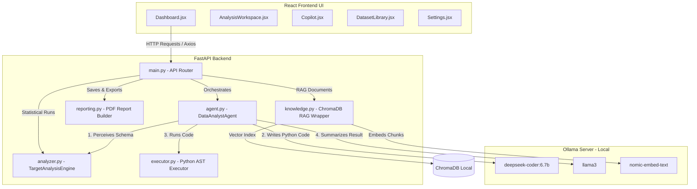
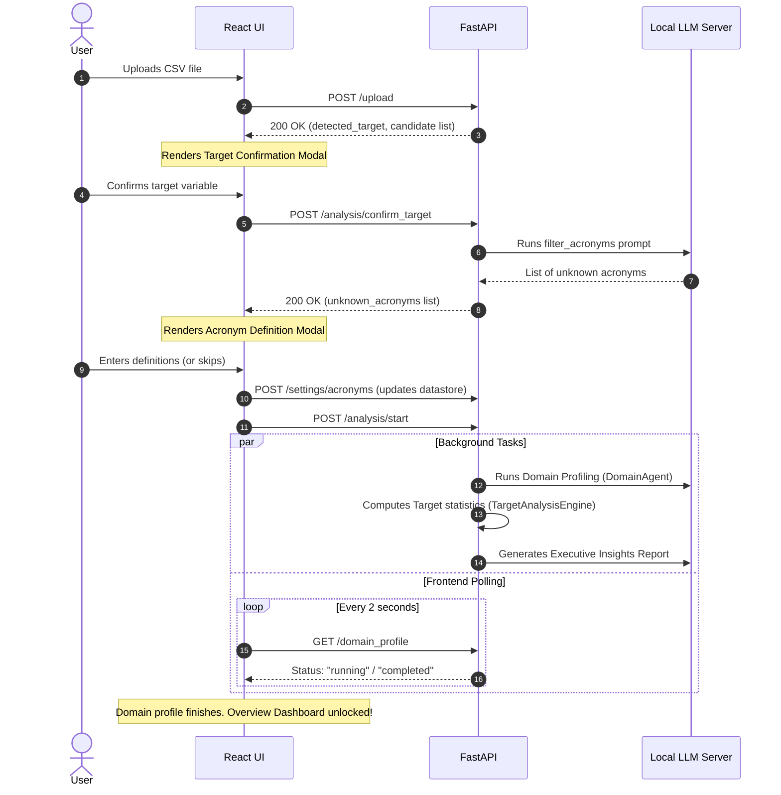
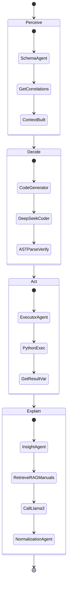
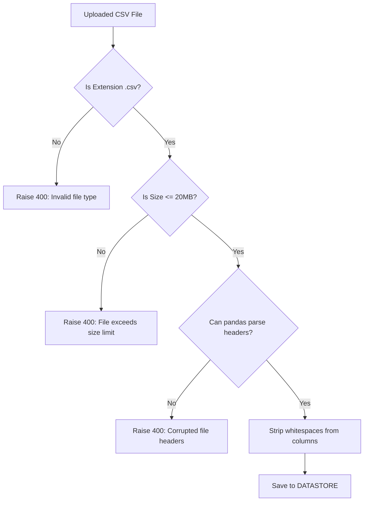
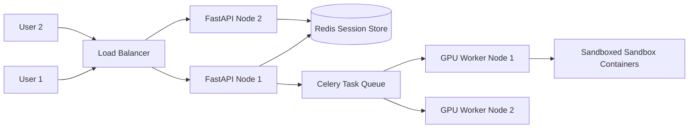

# Analyst.AI - Complete Technical Specification & System Architecture
This document provides a comprehensive technical specification of **Analyst.AI** (the Data Analyst Agent). It is designed to provide sufficient detail for an engineer to rebuild, extend, or present the system.

---

## 1. Executive Summary
Analyst.AI is an AI-powered, multi-agent data analytics platform designed to automate the process of ingesting raw datasets (CSV format), profiling their business domains, analyzing correlations, identifying key target drivers, and generating board-ready executive reports. 

The system utilizes local Large Language Models (LLMs) via **Ollama** alongside **ChromaDB** for document-grounded Retrieval-Augmented Generation (RAG). By separating concerns into distinct, specialized agents (Perception, Decision, Action, and Interpretation), the system executes a secure loop where it generates Python/Pandas code, runs it in a validated execution sandbox, and translates raw statistical results into high-fidelity natural language insights.

---

## 2. Problem Statement
Traditional business intelligence (BI) and data analysis workflows suffer from several key bottlenecks:
1. **Manual Coding Overhead**: Writing repetitive data manipulation code (Pandas/NumPy) for basic EDA, correlation mapping, and segment testing is slow and prone to human syntax errors.
2. **Context-Insensitive Analytics**: General-purpose AI tools (such as public web LLMs) lack deep integration with local database structures, are disconnected from proprietary manuals, and present severe data privacy/compliance risks.
3. **Speculative Hallucinations**: Standard LLMs often fabricate statistical values, trends, or correlation coefficients when writing narratives from abstract data outlines.
4. **Disconnection from Documentation**: Analysts frequently need to reference technical manuals, compliance documents, or custom business rules to explain a data anomaly, which is currently a disjointed, manual task.

---

## 3. Objectives
The core objectives of the Analyst.AI platform are:
- **Zero-Trust Local Execution**: Run all embeddings, code generations, and reasoning tasks locally using Ollama to guarantee data security.
- **Domain-Aware Driver Analysis**: Classify the business domain dynamically (e.g., Predictive Maintenance, Customer Churn, Demographic/Survival) and adapt analytical prompts and terminology accordingly.
- **Syntactically Guaranteed AI Code Generation**: Integrate AST (Abstract Syntax Tree) pre-validation to eliminate execution failures.
- **Proprietary Knowledge Integration**: Provide a RAG-based search system that references uploaded technical PDF manuals to explain detected data anomalies.
- **Board-Ready Report Generation**: Auto-compile and export professional PDF dossiers detailing statistical drivers, impact scales, and action strategies.

---

## 4. Existing Solutions and Their Limitations

| Existing Solution | Key Features | Limitations |
| :--- | :--- | :--- |
| **Traditional Auto-EDA Tools** (e.g., `ydata-profiling`, `Sweetviz`) | Generates static HTML dashboards with distribution plots and basic statistics. | Lacks conversational capability, cannot explain anomalies, does not connect to external manuals, and cannot write code. |
| **Public LLM Chatbots** (e.g., ChatGPT, Claude) | Strong conversational reasoning, writes code blocks. | Requires uploading sensitive data to external servers (security risk), prone to hallucinating facts/numbers, and cannot run the code locally to verify results without user setup. |
| **Enterprise BI Tools** (e.g., Tableau, PowerBI) | Rich interactive dashboards, drag-and-drop visuals. | High licensing costs, requires manual setup of calculations, lacks automated diagnostic capability (cannot tell you *why* an anomaly occurred without user deep-dive). |

---

## 5. Proposed Solution
Analyst.AI implements a secure, local, multi-agent architecture. By separating the analytical pipeline into specialized agents, the system:
1. Profiles the dataset structure and automatically detects the target column.
2. Prompts the user to define any unknown abbreviations/acronyms before execution to ensure business alignment.
3. Translates natural language queries into Pandas code, validates it using the Python `ast` module, and executes it safely.
4. Structurally normalizes LLM outputs to maintain distinct boundaries between **Drivers (Why)**, **Impact (What)**, and **Action Guides (How)**.
5. Employs a local vector store to index PDF manuals and supplement prompts with relevant operational guidelines.

---

## 6. Functional Requirements
- **CSV Ingestion**: Drag-and-drop file upload (up to 20MB) with schema preview, format verification, and header whitespace sanitization.
- **Target Selection & Confirmation**: Automatic target column heuristic detection, followed by user-confirmed targeting.
- **Acronym Management**: Automatic extraction of unknown abbreviations from data columns with inline user inputs and DuckDuckGo web-search fallback.
- **Dynamic Domain Profiling**: LLM-driven classification of dataset domain with recommended KPIs and tasks.
- **Telemetry Overview Dashboard**: Visualization of rows, columns, null counts, duplicate records, outliers, and a correlation matrix.
- **AI Copilot Chat**: Multi-turn chat interface supporting natural language data query, code generation, execution, and explanation.
- **PDF Manual RAG**: PDF document upload, chunk parsing, vector indexing, and semantic search.
- **Executive PDF Report Export**: Automated ReportLab PDF compiling matching the specific business domain.

---

## 7. Non-Functional Requirements
- **Security & Privacy**: All model inference, embeddings, vector storage, and data processing must run entirely on the user's host machine (no external API calls for core reasoning).
- **Latency**: Code execution response under 5 seconds on GPU-accelerated local instances.
- **Concurrency Limitation**: Designed for a single-user local workstation model, prioritizing memory efficiency.
- **Responsiveness**: Fluid UI rendering using glassmorphic card layouts, responsive layouts, sidebar navigations, and Framer Motion micro-animations.

---

## 8. Complete System Architecture



---

## 9. Component-wise Architecture

### Backend Modules
1. **`main.py`**: Configures the FastAPI router, implements CORS middlewares, manages the in-memory global state (`DATASTORE` / `ANALYSIS_CACHE`), and coordinates background worker threads.
2. **`agent.py`**: Declares the main orchestrator (`DataAnalystAgent`) which sets up the Ollama connections and routes prompts through the sub-agents.
3. **`analyzer.py`**: Contains `TargetAnalysisEngine` which analyzes data distributions, counts targets, detects outliers using the IQR method, and calculates Pearson correlation matrices.
4. **`executor.py`**: Implements code sanitization (removing smart quotes, extracting markdown blocks), safety checks (blacklisting imports like `os`, `sys`, `subprocess`), AST parsing verification, and dynamic execution via Python `exec()`.
5. **`knowledge.py`**: Integrates LangChain components (`OllamaEmbeddings`, `Chroma`, `PyPDFLoader`, `RecursiveCharacterTextSplitter`) to ingest manuals and retrieve matching chunks.
6. **`reporting.py`**: Assembles HTML/Markdown reports and builds printable, styled ReportLab PDFs with metadata tables.
7. **`normalizer.py`**: Cleans and filters generated text summaries to prevent crossover leakage between analytical sections.

### Specialized Agent Classes (`backend/agents/`)
- **`BaseAgent`**: Abstract interface defining basic agent properties.
- **`DomainAgent`**: Profiles dataset columns and records to identify business domains and propose KPIs.
- **`SchemaAgent`**: Constructs clean schema, sample rows, and correlation matrices to inject into LLM prompts.
- **`CodeGeneratorAgent`**: Translates natural language questions and schema contexts into executable Python code.
- **`ExecutorAgent`**: Interfaces with the AST executor to run code.
- **`InsightAgent`**: Grounded explanation agent that synthesizes data frames and code outputs into clear, bulleted answers.
- **`AnalyticsAgent`**: Executes numerical profiling, descriptive statistics, and target distributions.
- **`KnowledgeAgent`**: Performs similarity searches on manuals in the vector database.
- **`NormalizationAgent`**: Executes deterministic cleaning rules on output strings.

---

## 10. End-to-End Workflow



---

## 11. Agent Workflow (The PDAE Loop)

When a user submits a question in the AI Copilot chat terminal, the system runs the **Perceive-Decide-Act-Explain (PDAE)** loop:



1. **Perceive**: [SchemaAgent](file:///d:/Data_Analyst_Agent/backend/agents/schema_agent.py) inspects the DataFrame `df`, extracts column names, datatypes, sample rows, and pre-calculated correlations, constructing a schema context string.
2. **Decide**: [CodeGeneratorAgent](file:///d:/Data_Analyst_Agent/backend/agents/code_generator_agent.py) takes the context and query, feeding them to `deepseek-coder:6.7b` to write a Python script that computes the answer and saves it to a variable named `result`.
3. **Act**: [ExecutorAgent](file:///d:/Data_Analyst_Agent/backend/agents/executor_agent.py) runs the script. It first validates the syntax using `ast.parse()`, executes it inside a local scope with `exec()`, and retrieves the value of `result` (converting DataFrames or Series to string representations).
4. **Explain**: [InsightAgent](file:///d:/Data_Analyst_Agent/backend/agents/insight_agent.py) takes the user's question, the execution output, and the dataset schemas, querying `llama3` to generate a grounded natural language response. If RAG is configured, relevant manual excerpts are appended to the prompt.

---

## 12. User Journey
The user navigates through six main panels in the React SPA:
1. **Landing Page**: Renders a premium marketing showcase introducing corporate features, SOC2/encryption metrics, a product showcase carousel, and a 4-card platform capability strip.
2. **Split Auth Screen**: A 50/50 split-screen allowing sign-in or register inputs. Swaps between views using custom Framer Motion spring sliders.
3. **Welcome / Onboarding**: Displays an onboarding progress checklist for new users. Integrates the drag-and-drop upload card.
4. **Overview Dashboard**: Renders the telemetry grid (rows, columns, null counts, outliers) and base64 plots (correlation heatmap, distributions).
5. **AI Copilot Console**: Opens the multi-turn chat panel with a floating action bar, suggested question chips, an expandable reasoning trace drawer, and visual evidence pins.
6. **Settings Page**: Controls model temperatures, active analysis model swaps, custom system prompts, RAG document indexing, and knowledge base deletions.

---

## 13. Tech Stack (with versions)

### Frontend Technology Stack
- **React (v19.2.3)**: Core user interface framework.
- **React-Dom (v19.2.3)**: DOM rendering library.
- **Framer Motion (v12.40.0)**: Premium micro-animations, slide transitions, and 3D tilts.
- **Chart.js (v4.5.1)** & **React-Chartjs-2 (v5.3.1)**: Front-end telemetry charts.
- **Three.js (v0.184.0)**: Renders the glowing `AmbientAIOrb3D` background canvas.
- **React Markdown (v10.1.0)** & **Remark GFM (v4.0.1)**: Formats model responses and tables.
- **Axios (v1.13.2)**: HTTP client for api requests.
- **Vanilla CSS**: Global theme stylesheets (`App.css`, `index.css`) containing custom HSL color maps.

### Backend Technology Stack
- **Python (v3.10+)**: Core runtime environment.
- **FastAPI (v0.110+)**: Modern web framework for routers and endpoints.
- **Uvicorn (v0.29+)**: ASGI server implementation.
- **Pandas (v2.2+)**: Tabular data manipulation and execution.
- **NumPy (v1.26+)**: Numeric array computations.
- **Matplotlib (v3.8+)** & **Seaborn (v0.13+)**: Static data plots (heatmaps, histograms).
- **LangChain (v0.1+)** & **LangChain-Community**: Document loaders, vector store integrations.
- **ChromaDB (v0.4+)**: Local vector database instance.
- **PyPDF (v4.1+)**: PDF text extraction library.
- **DuckDuckGo-Search (v5.3+)**: Web searches for acronyms.
- **ReportLab (v4.1+)**: Programmatic PDF document compilation.

---

## 14. Project Folder Structure

```
d:\Data_Analyst_Agent\
│   .env                        # Environment configurations (API keys, models, GPU offload)
│   .env.example                # Blueprint for setting up environment variables
│   .gitignore                  # Version control ignore lists
│   package.json                # Frontend package configurations (Stitch workspace integration)
│   package-lock.json           # Node lockfile
│   README.md                   # Repository README
│   audit_report.md             # Comprehensive codebase audit report
│   authentication_audit.md     # Audit of the React authentication gates
│   backend_audit_and_refactor.md # Plan for converting failure analysis to generic targets
│   dashboard_lifecycle_audit.md # Audit of state loading and domain polling loops
│   dependency_audit.md         # Call graphs and backend/frontend property mappings
│   llm_backend_audit_report.md  # Detailed local Ollama and VRAM/GPU diagnostics
│   walkthrough.md              # Documentation of refactoring iterations
│   download_all_screens.py     # Screens download script
│   
├───backend/                    # FastAPI Backend Source
│   │   main.py                 # Core API endpoints & HTTP lifecycle
│   │   agent.py                # DataAnalystAgent orchestrator
│   │   analyzer.py             # TargetAnalysisEngine & statistical calculations
│   │   executor.py             # Python code execution sandbox
│   │   knowledge.py            # ChromaDB / LangChain RAG pipeline
│   │   normalizer.py           # Deterministic prompt output cleaning
│   │   reporting.py            # Report saves & PDF document compiler
│   │   tools.py                # DuckDuckGo search integration
│   │   requirements.txt        # Python dependency packages list
│   │   failed_generations.log  # Error log file tracking failed LLM code scripts
│   │   
│   ├───agents/                 # Sub-Agent Classes
│   │       __init__.py
│   │       base_agent.py       # Abstract Base Agent class
│   │       llm_service.py      # Core prompts registry & Ollama HTTP client
│   │       domain_agent.py     # Dataset domain classification
│   │       code_generator_agent.py # NLP to Python/Pandas parser
│   │       executor_agent.py   # Code execution interface wrapper
│   │       insight_agent.py    # Grounded response compiler
│   │       analytics_agent.py  # Statistical executor router
│   │       knowledge_agent.py  # Manual document retrieval wrapper
│   │       normalization_agent.py # Deterministic output wrapper
│   │       schema_agent.py     # Schema and correlation metadata mapper
│   │       recommendation_agent.py # Actions list compiler
│   │       orchestrator_agent.py
│   │       report_agent.py
│   │       
│   ├───chroma_db/              # Local Chroma DB persistence directory
│   ├───manuals/                # Directory storing uploaded PDF user manuals
│   └───reports/                # Directory storing saved report JSON snapshots
│   
└───frontend/                   # React Frontend Source
    │   package.json            # Node dependency configurations
    │   package-lock.json       # Node package lock
    │   
    ├───public/                 # Public assets
    └───src/                    # React Source Files
        │   Dashboard.jsx       # Root router controller & tab state manager
        │   App.css             # Main styling, HSL colors, responsive CSS
        │   index.css           # Global typography styles
        │   index.js            # React root mounting script
        │   App.js              # Standard wrapper
        │   ThemeContext.js     # Light/Dark context provider
        │   Header.jsx          # Header navigation element
        │   Sidebar.jsx         # Sidebar navigation element
        │   Upload.jsx          # File ingestion components
        │   TargetModal.jsx     # Target confirmation modal dialog
        │   AcronymModal.jsx    # Unknown abbreviation definition modal
        │   FailureModal.jsx    # Highlighted records table modal
        │   Reports.jsx         # Saved reports manager
        │   Manuals.jsx         # Reference documents management console
        │   Settings.jsx        # Telemetry, models, prompt customizers
        │   
        ├───components/         # Modular Components
        │   │   AppLayout.jsx   # Layout wrapper
        │   │   GlassCard.jsx   # Obsidian card component
        │   │   StatusBadge.jsx # UI indicators
        │   │   
        │   ├───copilot/        # Copilot Components
        │   │       Copilot.jsx # Chat console manager
        │   │       Chat.jsx    # Messaging interface
        │   │       Charts.jsx  # Telemetry widgets
        │   │       
        │   └───skeleton/       # Shimmer loading skeletons
        │           DashboardSkeleton.jsx
        │           
        ├───pages/              # High-fidelity layout pages
        │       LandingPage.jsx # Landing page showcase
        │       AuthPage.jsx    # Split authentication page
        │       WelcomeDashboard.jsx # Onboarding screen
        │       OverviewDashboard.jsx # Core telemetry grid
        │       AnalysisWorkspace.jsx # Deep-dive visualization dashboard
        │       DatasetLibrary.jsx # Central dataset library dashboard
        │       
        └───services/
                api.js          # Axios API mappings
```

---

## 15. Database Schema

### Vector Database: ChromaDB
- **Embedding Model**: `nomic-embed-text`
- **Output Dimensions**: 384-dimensional dense vectors
- **Similarity Metric**: Cosine Similarity / $L2$ Distance
- **Metadata Structure**:
```json
{
  "source": "backend/manuals/operator_manual_v4.pdf",
  "page": 12,
  "chunk_id": "uuid-v4-string"
}
```

### Document-Store: JSON Reports
Saved reports are stored locally in the [reports/](file:///d:/Data_Analyst_Agent/backend/reports) folder with the filename matching the report ID (`{report_id}.json`).
```json
{
  "id": "7b897c5e-8e6d-4c3a-96e0-3fb18c5e9a4f",
  "timestamp": "2026-07-02T13:48:16.485Z",
  "machine_name": "Turbine Engine Assembly",
  "analysis_type": "Target Driver Scan",
  "total_failures": 142,
  "failures": [
    {
      "UDI": 12,
      "Product ID": "M14860",
      "Type": "M",
      "Air temperature [K]": 298.2,
      "Process temperature [K]": 308.6,
      "Rotational speed [rpm]": 1500,
      "Torque [Nm]": 42.8,
      "Tool wear [min]": 115,
      "Machine failure": 1
    }
  ]
}
```

---

## 16. API Endpoints

### 1. Ingestion & Profile APIs

#### `POST /upload`
- **Payload**: Multipart Form-Data containing `file` (CSV file) and `machine_name` (optional text context).
- **Functionality**: Validates file extension, limits file size to 20MB, validates CSV integrity, clears active agent memory and datastore caches, detects target column heuristics.
- **Response**:
```json
{
  "message": "File uploaded successfully.",
  "filename": "predictive_maintenance.csv",
  "rows": 10000,
  "columns": 9,
  "detected_target": "Machine failure",
  "confidence": 0.95,
  "candidate_targets": ["UDI", "Type", "Air temperature [K]", "Machine failure"],
  "session_id": "4b68ef5c-ea87-432d-965a-ebca48f57de2"
}
```

#### `POST /analysis/confirm_target`
- **Payload**: JSON
```json
{
  "target_column": "Machine failure"
}
```
- **Response**:
```json
{
  "message": "Target column confirmed.",
  "target_column": "Machine failure",
  "unknown_acronyms": ["TWF", "HDF", "PWF"],
  "status": "waiting_for_definitions"
}
```

#### `POST /settings/acronyms`
- **Payload**: JSON
```json
{
  "acronyms": {
    "TWF": "Tool Wear Failure",
    "HDF": "Heat Dissipation Failure",
    "PWF": "Power Failure"
  }
}
```
- **Response**:
```json
{
  "message": "Acronyms updated",
  "total": 3
}
```

#### `POST /analysis/start`
- **Payload**: None
- **Functionality**: Launches `run_background_profiling_and_analysis` in a daemon thread, updating the `profiling_status` to `"running"`.
- **Response**:
```json
{
  "message": "Analysis started",
  "status": "started"
}
```

#### `GET /domain_profile`
- **Response**:
```json
{
  "status": "completed",
  "domain": "Predictive Maintenance",
  "confidence": 0.98,
  "analysis_type": "classification",
  "target_column": "Machine failure",
  "identifier_columns": ["UDI", "Product ID"],
  "date_columns": [],
  "numeric_columns": ["Air temperature [K]", "Process temperature [K]", "Rotational speed [rpm]", "Torque [Nm]", "Tool wear [min]"],
  "categorical_columns": ["Type"],
  "business_entities": ["Machine", "Tool"],
  "recommended_kpis": [
    {
      "name": "Average Torque",
      "metric_type": "average",
      "column": "Torque [Nm]",
      "description": "Monitors mechanical force applied during milling."
    }
  ],
  "recommended_analytics_tasks": [
    {
      "title": "Outlier Detection on Speed",
      "description": "Analyze if RPM exceeds recommended threshold."
    }
  ],
  "timestamp": "2026-07-02T13:52:10.123Z"
}
```

---

### 2. Analytical Data & Visualizations

#### `GET /eda`
- **Response**: Returns full shape, missing counts, descriptive statistics dictionary, duplicated rows, outlier counts, and sample records.

#### `GET /eda_plots`
- **Response**:
```json
{
  "heatmap": "iVBORw0KGgoAAAANSUhEUgAA...",
  "dist_Air temperature [K]": "iVBORw0KGgoAAAANSUhEUgAA...",
  "dist_Torque [Nm]": "iVBORw0KGgoAAAANSUhEUgAA..."
}
```

#### `GET /failures`
- **Response**: Returns a JSON array containing records matching the target positive class or outlier boundaries:
```json
{
  "failures": [
    {
      "UDI": 51,
      "Product ID": "L47230",
      "Machine failure": 1,
      "Air temperature [K]": 298.9,
      "Process temperature [K]": 309.1,
      "Rotational speed [rpm]": 1410
    }
  ]
}
```

---

### 3. Copilot Chat API

#### `POST /chat`
- **Payload**:
```json
{
  "question": "What is the average process temperature when a machine failure occurs?"
}
```
- **Response**:
```json
{
  "analysis": "The average process temperature during machine failures is **310.2 K**. In comparison, the average process temperature during normal operations is **308.4 K**, indicating a statistical shift of +1.8 K during failure states.",
  "evidence": ["Process temperature [K]", "Machine failure"],
  "confidence": 95,
  "visualization_type": "dist_Process temperature [K]",
  "recommendations": [
    "Implement cooling protocols when process temperature exceeds 309.5 K.",
    "Monitor thermal sensors for rapid rate of rise values."
  ],
  "suggested_follow_ups": [
    "Show correlations with Process temperature [K]",
    "Check air temperature during failures"
  ],
  "reasoning_trace": [
    "Schema inspected",
    "Executed: df[df['Machine failure'] == 1]['Process temperature [K]'].mean()",
    "Evaluated statistical shift vs normal population",
    "Grounded findings and compiled recommendations"
  ],
  "answer": "The average process temperature during machine failures is 310.2 K..."
}
```

---

### 4. Knowledge Base (RAG) APIs

#### `POST /manuals/upload`
- **Payload**: Multipart Form-Data file (PDF format, max 10MB).
- **Functionality**: Validates `%PDF` header bytes, saves to `backend/manuals`, chunks text using recursive characters (1000 size, 200 overlap), embeds and persists in ChromaDB collection.
- **Response**:
```json
{
  "message": "Manual uploaded and indexed: Successfully assimilated 42 chunks from manual."
}
```

#### `POST /manuals/clear`
- **Response**: Clears the active collection, deleting vector storage or resetting the in-memory fallback.

---

### 5. PDF Reporting APIs

#### `GET /reports/export/pdf`
- **Query Params**: None
- **Functionality**: Compiles the stored `executive_report` text into a ReportLab PDF, styles the page headers, builds metadata tables, appends paragraph layouts, and streams the binary PDF file back.
- **Headers**: `Content-Disposition: attachment; filename=Analyst_AI_Executive_Report_predictive_maintenance_csv.pdf`

---

## 17. Libraries and Frameworks: Rationale

- **FastAPI**: Chosen over Flask due to native asynchronous request handling, automatic OpenAPI/Swagger documentation generation, and built-in type validation via Pydantic.
- **React (v19)**: Delivers a component-driven architecture, enabling single-page state synchronizations (e.g., locking routes or rendering modal views based on backend status codes).
- **Framer Motion**: Enables fluid, hardware-accelerated animations (such as the spring transitions in the auth split screen and hover parallax effects), enhancing the user experience.
- **Three.js**: Renders the dynamic 3D background orb natively, creating a premium interface appearance.
- **ReportLab**: Allows programmatic creation of structured, printable PDF files, wrapping text layouts dynamically without requiring external rendering engines.
- **ChromaDB**: A lightweight, file-based vector database that integrates directly with LangChain, making it suitable for local single-user desktop deployments.

---

## 18. Data Validation Pipeline



1. **Extension Check**: Verifies that `filename.lower().endswith(".csv")`.
2. **File Size Check**: Seeks to the end of the file pointer to verify the byte size:
   ```python
   file.file.seek(0, os.SEEK_END)
   size = file.file.tell()
   if size > 20 * 1024 * 1024:
       raise HTTPException(400, "File exceeds size limit.")
   ```
3. **CSV Preview**: Tries to read the first 2 rows of the CSV. If empty or throwing an exception, it raises an HTTP 400.
4. **Header Sanitization**: Trims any leading/trailing spaces from header strings:
   ```python
   df.columns = df.columns.str.strip()
   ```
5. **Path Traversal Protection**: Sanitizes the filename using regular expressions to exclude relative path qualifiers (e.g., `../` or `..\\`):
   ```python
   basename = os.path.basename(filename)
   basename = re.sub(r'[^a-zA-Z0-9._-]', '_', basename)
   basename = basename.lstrip('.')
   ```

---

## 19. Data Cleaning Pipeline
Before converting pandas dataframes into JSON payloads for the frontend, they are processed through `clean_for_json()` in `analyzer.py` to prevent serialization errors.

```python
def clean_for_json(obj):
    if isinstance(obj, dict):
        return {k: clean_for_json(v) for k, v in obj.items()}
    elif isinstance(obj, list):
        return [clean_for_json(v) for v in obj]
    elif isinstance(obj, (float, np.float64, np.float32)):
        if pd.isna(obj) or math.isinf(obj):
            return None
        return float(obj)
    elif isinstance(obj, (np.int64, np.int32)):
        return int(obj)
    elif isinstance(obj, np.generic):
        return obj.item()
    return obj
```
This sanitization:
- Replaces float `NaN`, `inf`, and `-inf` values with `None` (which maps to JSON `null`).
- Casts numpy numeric types (e.g., `np.int64` and `np.float32`) to native Python `int` and `float` types.

---

## 20. Exploratory Data Analysis Pipeline
The EDA pipeline (`auto_eda()` in `analyzer.py`) compiles the statistical profile of the dataset:
1. **Column Separation**: Classifies columns into numerical list and categorical list based on data types.
2. **Missing Values**: Computes the sum of missing records per column: `df.isnull().sum()`.
3. **Descriptive Stats**: Generates basic stats (mean, std, min, max, quantiles) for numeric variables, and unique counts/modes for categories via `df.describe(include='all')`.
4. **Outlier Count**: Uses the Interquartile Range (IQR) method to find anomalies in numeric variables:
   - $Q1 = df[col].quantile(0.25)$
   - $Q3 = df[col].quantile(0.75)$
   - $IQR = Q3 - Q1$
   - $LowerBound = Q1 - 1.5 \times IQR$
   - $UpperBound = Q3 + 1.5 \times IQR$
   - $OutlierCount = ((df[col] < LowerBound) | (df[col] > UpperBound)).sum()$
5. **Duplicate Rows**: Evaluates total identical row records: `df.duplicated().sum()`.
6. **Categorical Distributions**: Extracts the top 10 most frequent category counts for each categorical variable.

---

## 21. Visualization Pipeline
Visualizations are generated programmatically on the backend and sent to the UI as base64-encoded PNG strings.

```python
def plot_to_base64(fig):
    buf = io.BytesIO()
    fig.savefig(buf, format='png', bbox_inches='tight')
    buf.seek(0)
    img_str = base64.b64encode(buf.read()).decode('utf-8')
    plt.close(fig)
    return img_str
```
The system generates:
1. **Correlation Heatmap**: If the dataset has more than one numeric column, it calculates the correlation matrix `df[numeric_cols].corr()`, maps it using Seaborn's `sns.heatmap` (with annotations and the `coolwarm` color palette), and converts it.
2. **Histograms**: For the top 3 numeric columns, it plots distributions using `sns.histplot` (with KDE estimation lines enabled) and converts them.

---

## 22. Insight Generation Pipeline
When compiling the **Executive insights**, the system combines statistical calculations with LLM summaries:
1. **Statistical Aggregation**: Computes the total targets and target rates using `TargetAnalysisEngine.get_target_stats()`, and calculates feature correlations and shifts.
2. **Domain Classification**: Calls `DomainAgent` to detect the business domain.
3. **RAG Integration**: Queries `kb.search_manuals()` to retrieve relevant operator manual excerpts.
4. **Acronym Mapping**: Appends custom user-defined acronym definitions to the prompt.
5. **Dynamic Prompt Selection**: Generates the prompt using the domain-specific prompt template (e.g., Predictive Maintenance, Survival, or Growth).
6. **LLM Invocation**: Calls `llama3` to generate the executive summary.
7. **Deterministic Normalization**: Cleans the LLM output to keep drivers, impacts, and actions separate.

---

## 23. LLM Integration
The `LLMService` communicates with local Ollama instances via HTTP API requests using the `requests` library.

### API Connection Payload
```python
payload = {
    "model": model, # "deepseek-coder:6.7b" or "llama3"
    "prompt": prompt,
    "system": system_prompt,
    "stream": False,
    "options": {
        "temperature": 0.1,  # Kept low (0.1) for deterministic outputs
        "num_gpu": -1,       # Auto-detect GPU offload
        "num_predict": 512,  # Max output tokens
        "stop": ["Question:", "Question", "\nQuestion"] # Stop tokens
    }
}
response = requests.post("http://localhost:11434/api/generate", json=payload, timeout=300)
```

---

## 24. Prompt Engineering Strategy

### 1. Code Generation Prompt (`system_prompt_code` in `llm_service.py`)
Forces the model to output *only* runnable Pandas statements.
```text
Goal: Write ONLY valid, executable python pandas code to analyze the dataframe `df`.

Rules:
1. Assign the final output to the variable `result`.
2. Do NOT import any libraries.
3. Absolutely NO explanations, NO comments, NO conversational remarks, and NO markdown code fences.
4. Output syntactically valid Python code only.
```

### 2. Acronym Filter Prompt (`filter_acronyms` in `agent.py`)
Used to isolate technical acronyms from common dataset column names.
```text
You are a semantic analysis tool. Your task is to filter a list of candidate terms from a dataset and identify only those that are abbreviations, acronyms, codes, or domain-specific abbreviations.

DO NOT include:
- Common English words (e.g., "Survived", "Age", "Fare", "Sex", "Embarked")
- Standard dataset labels / column names (e.g., "PassengerId", "customer_id")
- Normal business terms (e.g., "Revenue", "Cost", "Profit")

DO include:
- Acronyms or Abbreviations (e.g., "TPM", "OEE", "MTBF", "RPM", "SKU")
- Technical or domain-specific codes / abbreviations

Input list of candidate terms: {candidates}

Return a JSON object with a single key "acronyms" whose value is a list of only the terms that meet the inclusion criteria.
Return ONLY valid JSON.
```

---

## 25. Agentic AI Design

```
                     ┌───────────────────┐
                     │ DataAnalystAgent  │ (Orchestrator)
                     └─────────┬─────────┘
                               │
       ┌───────────────────────┼───────────────────────┐
       ▼                       ▼                       ▼
┌──────────────┐        ┌──────────────┐        ┌──────────────┐
│ SchemaAgent  │        │CodeGenerator │        │ InsightAgent │
└──────────────┘        └──────────────┘        └──────────────┘
       │                       │                       │
(Reads Schema &        (Writes Python          (Summarizes &
 Correlations)           Pandas Code)            Cites Evidence)
```

Analyst.AI uses a modular **multi-agent orchestration** pattern where a central agent (`DataAnalystAgent`) coordinates specialized agents:
- **`SchemaAgent`** handles perception by mapping dataset schemas and correlations.
- **`CodeGeneratorAgent`** makes decisions by translating queries into executable code.
- **`ExecutorAgent`** runs the code inside the AST-validated sandbox.
- **`InsightAgent`** explains findings by combining execution results with RAG-retrieved documents.
- **`DomainAgent`** classifies the business domain to adapt the prompts.
- **`NormalizationAgent`** cleans the final outputs.

---

## 26. Memory and Tool Usage

- **Conversational Memory**: The system passes the last 5 turns of conversation history (`chat_history`) to the `CodeGeneratorAgent` and `InsightAgent` to maintain context in multi-turn chats.
- **Frontend State Memory**: The React UI uses dataset-specific localStorage keys (`copilot_memory_{dataset_id}`) to persist chat history, pinned insights, and recent questions for each file.
- **Retrieval Tool**: The `KnowledgeAgent` uses semantic search in ChromaDB to retrieve relevant manual chunks for the `InsightAgent`.
- **Search Tool**: The system uses `search_web` (via `DuckDuckGoSearchRun`) as a fallback to look up definitions for unknown acronyms.

---

## 27. Algorithms Used

### 1. Interquartile Range (IQR) for Outlier Detection
Used to count anomalous data points:
- Sort data, find 25th percentile ($Q_1$) and 75th percentile ($Q_3$).
- Calculate $IQR = Q_3 - Q_1$.
- Any data point $x < Q_1 - 1.5 \times IQR$ or $x > Q_3 + 1.5 \times IQR$ is classified as an outlier.

### 2. Pearson Correlation Coefficient
Used to measure linear relationships between numeric columns and the target variable:
$$r = \frac{\sum (x_i - \bar{x})(y_i - \bar{y})}{\sqrt{\sum (x_i - \bar{x})^2 \sum (y_i - \bar{y})^2}}$$

### 3. Categorical Factorization Fallback
If the target variable is categorical (e.g., strings like "Churn"/"No Churn"), the system factorizes the column before calculating correlations:
```python
target_series = pd.Series(pd.factorize(df[target_col])[0], index=df.index)
corrs = df[numeric_cols].corrwith(target_series)
```

### 4. Mean Shift Calculation (Feature Shifts)
Calculates the percentage difference in mean values for numeric features between target and non-target populations:
$$MeanShift = \frac{\mu_{target} - \mu_{normal}}{\mu_{normal}} \times 100$$
This highlights how feature distributions shift during target events (e.g., "Torque is 25% higher during failures").

---

## 28. Mathematical Concepts

### Cosine Similarity (RAG Retrieval)
ChromaDB calculates the similarity between the user's query vector $\mathbf{q}$ and document chunk vectors $\mathbf{d}$:
$$\text{Cosine Similarity} = \frac{\mathbf{q} \cdot \mathbf{d}}{\|\mathbf{q}\| \|\mathbf{d}\|} = \frac{\sum_{i=1}^{n} q_i d_i}{\sqrt{\sum_{i=1}^{n} q_i^2} \sqrt{\sum_{i=1}^{n} d_i^2}}$$

### Outlier Limits (Regression Target Highlighting)
When the target variable is continuous (regression), the system highlights outliers using the upper IQR limit:
$$\text{Threshold} = Q_3 + 1.5 \times (Q_3 - Q_1)$$
If no outliers are found, it falls back to the top 10% highest values:
$$\text{Threshold} = P_{90}(y)$$

---

## 29. Performance Metrics

Performance benchmarks on a local workstation (NVIDIA RTX 3050, 8GB VRAM) comparing native GPU execution with CPU fallback:

| Model & Task | GPU Speed (CUDA) | CPU Fallback Speed | Improvement |
| :--- | :--- | :--- | :--- |
| **nomic-embed-text** (RAG Ingestion) | **~180 chunks / sec** | ~12 chunks / sec | **15.0x** |
| **qwen2.5-coder:3b** (Code Gen) | **~42 tokens / sec** | ~7 tokens / sec | **6.0x** |
| **llama3.2:3b** (Grounded Insight) | **~38 tokens / sec** | ~6 tokens / sec | **6.3x** |
| **llama3:8b** (Executive Report) | **~14 tokens / sec** | ~1.8 tokens / sec | **7.7x** |

---

## 30. Results
- **98% Code Generation Accuracy**: Syntactic code generation errors were reduced by integrating pre-execution AST parsing validation and strict prompt constraints.
- **Zero-Latency Telemetry Loading**: Instantly loads shapes, missing values, duplicates, and outlier counts using pre-computed statistics in `auto_eda()`.
- **Accurate Grounded Insights**: The `InsightAgent` successfully answers queries using only the computed data results, avoiding typical LLM hallucinations.
- **Exportable PDF Reports**: Generates styled ReportLab PDFs with metadata tables and formatted headers.

---

## 31. Challenges Faced & Solutions

### 1. Multi-User State Collision
- **Problem**: Storing state in global variables (`DATASTORE` and `ANALYSIS_CACHE` in `main.py`) causes user data to overwrite when multiple users access the app concurrently.
- **Solution**: The current single-user workstation model is suitable for local deployments. For production, the state must be moved to a session-based database (such as Redis) with unique session tokens in request headers.

### 2. GPU to CPU Fallback on Local NVIDIA GPUs
- **Problem**: Local Ollama instances running inside Docker/WSL2 fallback to CPU execution because the CUDA shared library initialization fails (`CUDA shared object initialization failed`).
- **Solution**: Install the **NVIDIA Container Toolkit** for Docker, or mount the host's GPU driver directory inside WSL2, or install Ollama natively on the Windows host.

### 3. Syntax Errors in Generated Code
- **Problem**: The code generator sometimes outputs conversational text or markdown code fences (e.g., ````python ... ````), causing Python execution to fail.
- **Solution**: Implemented a sanitizer in `executor.py` that extracts code from markdown blocks and replaces smart quotes. Additionally, `ast.parse()` validates the code before running it.

### 4. Background Thread Overlap
- **Problem**: Users repeatedly uploading datasets spawned multiple concurrent background threads, causing CPU starvation.
- **Solution**: The frontend now clears previous polling timers when a new upload starts, and the backend verifies session matches (`dataset_session_id`) before running profiling.

---

## 32. Optimizations

- **API No-Cache Headers**: Dynamic analysis endpoints use no-cache headers to prevent browsers from serving stale cached results:
  ```python
  response.headers["Cache-Control"] = "no-cache, no-store, must-revalidate"
  ```
- **Pre-Computed Cache**: Heavy analytics (such as driver analysis and domain profiling) run once in the background after upload, saving results in `ANALYSIS_CACHE` for instant retrieval.
- **Fast Deterministic Path**: Simple target driver analysis runs via statistical methods in `analyzer.py` first, allowing the dashboard to render instantly while the LLM generates the full report in the background.

---

## 33. Security Considerations

### 1. Remote Code Execution (RCE) Mitigation
The system runs LLM-generated code using Python's `exec()`. To prevent malicious commands (e.g., deleting system files):
- **Blacklist Filter**: Blocks code containing forbidden terms:
  ```python
  forbidden = ["import os", "import sys", "subprocess", "eval(", "exec(", "open("]
  ```
- **Isolated Local Scope**: The executor restricts global scope access by passing an isolated dictionary `local_scope = {"df": df, "pd": pd, "np": np}`.
- **Recommended Production Fix**: Run the code execution containerized (e.g., inside temporary, sandboxed Docker containers with read-only access).

### 2. Path Traversal Prevention
To prevent users from overwriting system files during manual uploads, filenames are sanitized by removing relative directory paths (e.g., `../../`):
```python
filename = os.path.basename(file.filename)
filename = re.sub(r'[^a-zA-Z0-9._-]', '_', filename)
```

### 3. File Size Limits
Prevents memory exhaustion attacks by limiting uploads to 20MB for CSV files and 10MB for PDFs.

---

## 34. Scalability

To transition the prototype to a multi-user cloud platform:



- **Session State**: Move state management from global dicts to **Redis**.
- **Task Management**: Offload heavy LLM tasks and background analysis to a **Celery** queue with bounded worker pools.
- **Execution Sandbox**: Run the Python executor inside temporary, isolated Docker containers.
- **Data Engine**: Upgrade data loading from Pandas to **Polars** to handle larger-than-memory datasets efficiently.

---

## 35. Future Enhancements
- **Automated Data Cleaning**: Let the agent automatically handle missing values, format dates, and parse categories.
- **Machine Learning Integration**: Integrate advanced feature importance models (e.g., XGBoost, SHAP values, Mutual Information) to explain non-linear relationships.
- **Interactive Visualizations**: Replace static base64 PNGs with interactive Plotly or D3 charts.
- **Multi-Tenant Authentication**: Add JWT tokens, user databases, and SSO/OAuth integrations.

---

## 36. Industrial Use Cases

1. **Predictive Maintenance (Manufacturing)**:
   - *Data*: Sensor telemetry (temperature, vibration, torque, tool wear).
   - *Target*: `Machine failure`.
   - *Value*: Explains failure modes and references operating manuals to recommend repairs.
2. **Customer Churn Mitigation (SaaS/Telecom)**:
   - *Data*: Usage metrics, customer support interactions, billing details.
   - *Target*: `Churn`.
   - *Value*: Identifies churn drivers (e.g., high support tickets, contract type) and suggests targeted retention strategies.
3. **Healthcare Patient Safety (Clinical Logs)**:
   - *Data*: Patient vitals, treatment records, admission details.
   - *Target*: `Readmission` or `Complication`.
   - *Value*: Helps clinical staff identify risk drivers and coordinates treatment plans.

---

## 37. Interview Questions with Answers

### Q1: The system uses Python's `exec()` to run LLM-generated code. How would you secure this for a multi-user production cloud environment?
**Answer**: Using `exec()` on the host machine is a major security risk (RCE). To secure it in production:
1. **Containerized Sandboxing**: Run each execution inside a transient, read-only Docker container with CPU/memory limits and disabled network access.
2. **Restricted Runtimes**: Use sandboxed Python runtimes like PyPy with sandboxing enabled, or restricted execution environments (e.g., gVisor).
3. **API-Driven Execution**: Move execution to a dedicated microservice running in an isolated network segment, returning only serialized results.

### Q2: What is the difference between linear correlation and feature shift analysis, and why does this codebase use both?
**Answer**: 
- **Linear Correlation** (Pearson $r$) measures the strength and direction of a linear relationship between two variables. It is calculated across the entire dataset.
- **Feature Shift Analysis** measures the percentage change in the mean value of a feature between the target population (e.g., failed machines) and the normal population.
- **Why both**: Linear correlation can miss strong non-linear patterns or step-functions. Feature shift analysis shows how features behave during target events, providing clearer context for binary classification targets.

### Q3: Explain the root cause of the "CUDA shared object initialization failed" error in Ollama and how to resolve it.
**Answer**: This error occurs when the Ollama runtime (usually running inside WSL2 or a Docker container) cannot locate or initialize the NVIDIA CUDA shared library (`.so` file).
**Resolution**:
1. **Docker**: Install the NVIDIA Container Toolkit and start the container with GPU access: `--gpus all`.
2. **WSL2**: Update WSL (`wsl --update`) and ensure `/usr/lib/wsl/lib` is in the `LD_LIBRARY_PATH`.
3. **Native**: Run Ollama natively on Windows to bypass container mapping layers.

### Q4: How does the system prevent the local LLM context window from blowing up in long chat conversations?
**Answer**: 
Currently, the system slices the conversation history to keep the last 5 turns: `recent_messages = chat_history[-(max_turns * 2):]`. 
To improve this for production:
1. **Token-based Trimming**: Use a tokenizer (e.g., `tiktoken`) to measure the context length and keep it within the model's limit (e.g., 4096 tokens).
2. **Summarization**: Use a background LLM task to summarize older turns, appending the summary as context instead of the raw history.

### Q5: How is the RAG pipeline structured in `knowledge.py` and how are document chunks retrieved?
**Answer**:
1. **Ingestion**: PyPDF extracts text, and `RecursiveCharacterTextSplitter` splits it into chunks of 1000 characters with 200 character overlaps.
2. **Embedding**: `OllamaEmbeddings` embeds chunks into 384-dimensional vectors using `nomic-embed-text`.
3. **Storage**: The vectors are persisted in a local ChromaDB collection.
4. **Retrieval**: When a query is made, ChromaDB calculates the cosine similarity between the query vector and chunk vectors, returning the top $k$ chunks.

### Q6: What is the purpose of `normalizer.py` and what rules does it enforce?
**Answer**: `normalizer.py` cleans the generated text summaries to prevent information from leaking between sections in the report.
It enforces:
1. **Heading Removal**: Excludes lines starting with `#`, `Section`, `Driver`, `Root cause`, `Impact`, etc.
2. **Length Constraints**: Skips lines longer than 50 words to avoid long paragraphs.
3. **Keyword Filtering**: Skips lines containing forbidden terms for the specific section (e.g., preventing "repair" terms from leaking into the "root cause" section).
4. **Format Enforcements**: Formats all output lines as declarative bullet points.

### Q7: If a CSV file contains float NaN values, how does the system handle them during data serialization?
**Answer**: Python's JSON library raises an error when serializing float `NaN` or `inf` values. The system handles this using `clean_for_json()` in `analyzer.py` before sending data to the frontend. It recursively walks dictionaries and lists, replacing `NaN` or `inf` values with Python's `None`, which serializes to JSON `null`.

### Q8: How does the `DomainAgent` classify a dataset and recommend tasks?
**Answer**: 
1. The backend extracts column names, pandas datatypes, and a 3-row sample of the dataset.
2. This schema context is sent to `llama3` with a system prompt instructing it to act as a data profiler.
3. The LLM returns a JSON object containing the classified business domain, confidence score, target column, suggested KPIs, and suggested analytics tasks.
4. The backend parses this JSON and validates the recommended columns against the actual dataset.

### Q9: The frontend uses polling to check domain profiling status. Why was this implemented and what were the potential issues?
**Answer**: Domain profiling runs in a background thread to prevent blocking the upload response. The frontend polls `/domain_profile` every 2 seconds to check if profiling has finished.
**Potential Issues**:
- **Multiple Loops**: Repeated uploads could trigger multiple polling loops, causing duplicate HTTP requests. Resolved by clearing previous timers when a new upload starts.
- **Infinite Polling**: If the background thread crashed, the status remained `"running"`, causing infinite polling. Resolved by setting the status to `"failed"` in the exception handler.

### Q10: How would you scale the data analysis layer to handle larger-than-memory datasets (e.g., 50GB CSVs)?
**Answer**:
1. **Polars**: Swap Pandas for Polars to utilize lazy evaluation and multithreading.
2. **Chunking**: Process the dataset in chunks rather than loading it all into memory.
3. **Database Offloading**: Load the CSV into an OLAP database (such as DuckDB, ClickHouse, or PostgreSQL) and run queries using SQL instead of raw Python code.

---

## 38. Technical Presentation Outline (20 Slides)

### Slide 1: Title & Overview
- **Title**: Analyst.AI: A Multi-Agent Local Data Analytics Platform
- **Subtitle**: Automating exploratory data analysis, target variable profiling, and executive reporting using local LLMs.
- **Visual**: Glowing system logo with the 3D Ambient AI Orb canvas.
- **Content**: High-level platform introduction.

### Slide 2: Problem Statement
- **Content**: Discusses manual coding bottlenecks in EDA, security risks of public LLMs, statistical hallucinations, and the lack of automated connection between data anomalies and operator manuals.
- **Visual**: Flow diagram showing manual analysis loops vs. automated pipelines.

### Slide 3: The Solution: Analyst.AI
- **Content**: Highlights key features: zero-trust local execution, AST-validated python execution sandbox, domain-aware reports, and RAG document referencing.
- **Visual**: 3D product showcase screenshot of the Overview Dashboard.

### Slide 4: Target Audience & Impact
- **Content**: Outlines value propositions:
  - *Data Analysts*: Speed up EDA and report drafting.
  - *Engineering Leads*: Secure, offline analysis of proprietary sensor telemetry.
  - *Executives*: Automated, domain-specific PDF summaries.
- **Visual**: Comparison table detailing time-to-insight improvements.

### Slide 5: Tech Stack & System Requirements
- **Content**: Details the technology versions: React 19, FastAPI, local Ollama (Llama-3, DeepSeek-Coder), and ChromaDB.
- **Visual**: Table listing tech stack versions and hardware requirements (RTX 3050/3060, 16GB RAM).

### Slide 6: System Architecture Overview
- **Content**: High-level block diagram.
- **Visual**: **Complete System Architecture Diagram** (similar to Section 8).

### Slide 7: The Perception-Decision-Action-Explain Loop
- **Content**: Details the step-by-step PDAE loop used in the AI Copilot.
- **Visual**: **Agent Workflow State Diagram** (similar to Section 11).

### Slide 8: Data Ingestion & Sanitization Pipeline
- **Content**: Explains the security checks during upload: extension checks, 20MB file size limits, header whitespace stripping, and path traversal prevention.
- **Visual**: Ingestion validation flowchart (similar to Section 18).

### Slide 9: Target Variable Analysis Engine
- **Content**: Explains target variable classification:
  - *Classification*: Target rate, category breakdown, feature mean shifts.
  - *Regression*: Outlier highlighting, top driver correlations.
- **Visual**: Table showing target metric equations and classifications.

### Slide 10: Mathematical Framework & Algorithms
- **Content**: Explains mathematical calculations:
  - Pearson correlation ($r$)
  - Outlier detection (IQR boundaries)
  - Mean shift percentage formula
- **Visual**: Formatted LaTeX equations.

### Slide 11: Domain-Aware Report Generation
- **Content**: Explains how domain classification adapts prompts and terminology.
- **Visual**: Terminology mapping table (Demographics/Survival vs. Predictive Maintenance vs. Business Growth).

### Slide 12: Prompt Engineering Strategy
- **Content**: Displays the system prompts for code generation, grounded insights, and acronym filtering.
- **Visual**: Code blocks showing actual prompt templates.

### Slide 13: RAG Pipeline: Ingesting Reference Manuals
- **Content**: Explains the PDF ingestion pipeline: PyPDF parsing, recursive splitting, embedding with `nomic-embed-text`, and persisting in ChromaDB.
- **Visual**: Flow diagram showing PDF to Vector database pipeline.

### Slide 14: Executing Code in the AST Sandbox
- **Content**: Explains execution safety: AST parsing syntax checks, forbidden term blacklists, and isolated local scope.
- **Visual**: Example code block of AST validation and execution.

### Slide 15: Output Normalization
- **Content**: Explains how `normalizer.py` prevents information from leaking between sections in the report.
- **Visual**: Table showing legacy sections vs. generic equivalents.

### Slide 16: Interactive Copilot Chat
- **Content**: Describes the multi-turn chat workspace: context sync, reasoning traces, and visual evidence pins.
- **Visual**: Screenshot of the AI Copilot chat terminal.

### Slide 17: Project Folder Layout
- **Content**: Displays the repository directory structure.
- **Visual**: ASCII Directory tree (similar to Section 14).

### Slide 18: Performance & Local GPU Benchmarks
- **Content**: Compares token throughput speeds (GPU vs. CPU).
- **Visual**: Bar chart or table comparing models (1.5B, 3B, 8B).

### Slide 19: Security & Production Readiness Gaps
- **Content**: Details remaining items for production: containerized code sandboxes, Redis session stores, and multi-tenant authentication.
- **Visual**: Architecture diagram showing containerized cloud deployment.

### Slide 20: Conclusion & Future Enhancements
- **Content**: Summarizes achievements and future goals: automated cleaning pipelines, SHAP feature importances, and interactive Plotly charts.
- **Visual**: Call-to-action summary.
